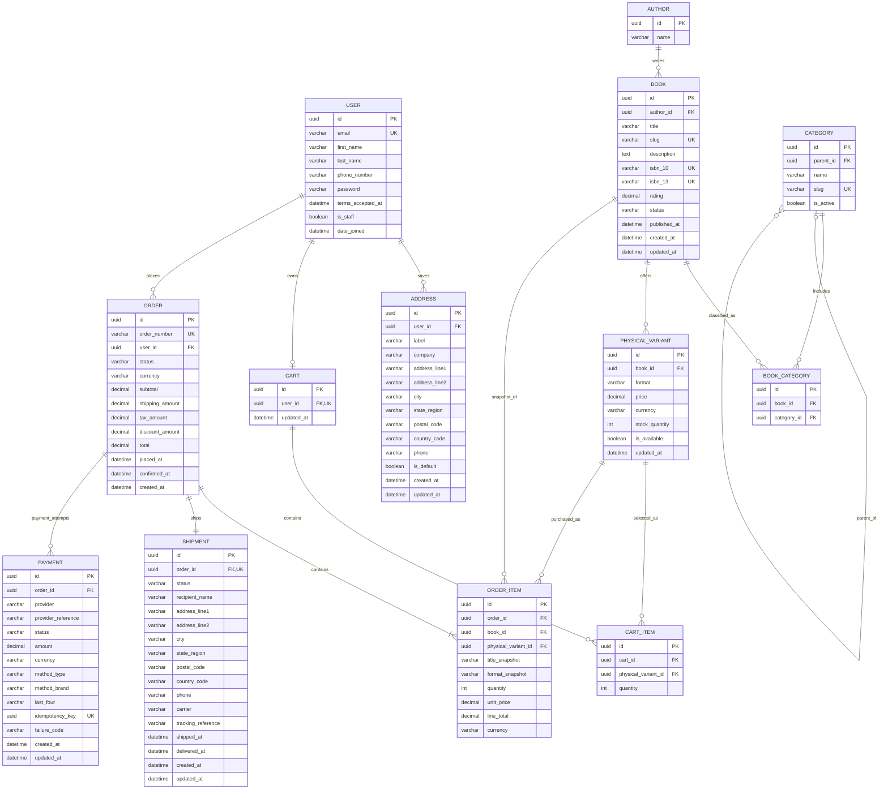

# BookBloom API Design

**Status:** Proposed contract; decisions below remain open.  
**Contract:** [OpenAPI 3.0.3](openapi.yaml)  
**Source of truth:** `docs/plan/online-bookstore-requirements.md` and `docs/database/database-architecture.md`.  
**Base URL assumption:** `/api/v1`; deployed host and token implementation are not specified.

## Architecture and DRF Conventions

Use domain-owned Django models as specified in the database document: `User`, `Address`, `Book`, `Author`, `Category`, `PhysicalVariant`, `Cart`, `CartItem`, `Order`, `OrderItem`, `Shipment`, and `Payment`. Keep serializers separated by intent: request serializers validate input, response serializers expose safe read models, and admin serializers require staff permissions. Do not expose password hashes, provider credentials, PAN, CVV, or raw provider events.

Use `APIView` or narrowly scoped viewsets for domain actions. Customer resources must be scoped to `request.user`; use object-level ownership checks for addresses, carts, and orders. Admin endpoints require authenticated Django staff/group permissions, including reads; writes are never available to customers. `User.is_staff` is server-managed and must never be customer-editable or exposed as an account update field. The current application user schema does not define `is_active` or `is_superuser`; use authentication lifecycle policy and Django groups/permissions without adding those user fields. Use explicit pagination (`page`, `pageSize`, maximum 100), allowlisted ordering/filter parameters, and a shared validation/error envelope. Rate-limit registration, login, and payment initiation. Audit staff catalog changes, shipment transitions, and access to order/contact data.

Persist creation/update timestamps only on models where they support history, editing, or operations; do not add them to every model by default. In this contract, `Address` exposes `createdAt` and `updatedAt`, `Cart` exposes `updatedAt`, `Order` exposes `createdAt`, and payment-attempt summaries expose `createdAt`. Order business-event fields `placedAt`/`confirmedAt` and Shipment business-event fields `shippedAt`/`deliveredAt` are also exposed. Generic model timestamps on `Book`, `PhysicalVariant`, and `Shipment`, plus `updatedAt` on `Payment`, are not exposed in their API response schemas. `CartItem`, `OrderItem`, `Author`, and `Category` have no generic creation/update timestamps in the current schema.

All monetary API values are two-decimal INR decimal **strings**, never JSON floats. `PhysicalVariant.price` is the current catalog price; checkout recalculates it server-side and persists immutable `OrderItem.unit_price`/`line_total` and `Order` totals. `Order.shippingAmount` is always `"0.00"`. The India tax amount is not determined by this contract. Catalog `Book.rating` is independent catalog data, not customer reviews; no rating write source is specified.

## Workflows and State

- **Identity:** `POST /auth/register` validates required name, email, phone, matching passwords, and true Terms acceptance. It discards `passwordConfirmation` and sets `terms_accepted_at` server-side. `User.is_staff` is server-managed and returned read-only in the profile; the current application schema does not define `is_active` or `is_superuser`. `POST /auth/login` returns a bearer token; `POST /auth/logout` revokes it; `GET /me` returns only the authenticated account. Registration/login are public; account endpoints require authentication.
- **Catalog:** Public `GET /books` and `GET /books/{bookId}` expose published physical books and variants. Each book has exactly one author for the current scope. Search spans title, author, and category; filters include category, inclusive INR price bounds, physical format, and 1–5 rating; ordering is allowlisted and paginated. Unavailable/out-of-stock variants cannot be added to cart. Rating data source and fractional rating bucket boundaries remain open.
- **Cart and addresses:** Authenticated customers use `GET /cart`, `POST /cart/items`, `PATCH /cart/items/{itemId}`, and `DELETE /cart/items/{itemId}` for their own cart. `GET/POST /addresses` and `GET/PATCH/DELETE /addresses/{addressId}` manage only their own saved addresses. Address country must be `IN`; `postalCode` must match `^[1-9][0-9]{5}$`. No alternate/gift recipient is supported: checkout snapshots the registered user's name into `Shipment.recipient_name` along with the selected address.
- **Order placement and payment:** `POST /checkout` requires a non-empty cart and idempotency key. Re-read current prices and lock/check stock transactionally; reject insufficient stock without a partial order. Create `Order` as `PENDING_PAYMENT`, immutable `OrderItem` snapshots, required `Shipment` address snapshot, and stock reservation/decrement atomically. `POST /orders/{orderId}/payment-attempts` initiates a separate attempt using `CARD` with `AMEX`, `VISA`, or `MASTERCARD`, or `PAYPAL`. Provider-hosted/tokenized payment is required; no card/payment secrets are accepted. `POST /payments/webhooks/{provider}` is provider-to-server only and must verify signatures, amount, currency, reference, and event deduplication. Browser return/redirect is not payment confirmation.
- **Confirmation and fulfillment:** A verified authoritative payment success may transition `Order.status` from `PENDING_PAYMENT` to `CONFIRMED`; a failed attempt leaves the order pending. Only after that transaction commits may the customer see the completion receipt (`GET /orders/{orderId}/confirmation`) and may an email be dispatched to the registered `User.email`. Dispatch is post-commit, retried on transient failure, and idempotent per confirmation event; email failure does not undo confirmation. `Shipment.status` is independent of `Order.status`. Staff change fulfillment through `PATCH /admin/orders/{orderId}/fulfillment`; it must not change payment or order confirmation state. Exact shipment transition policy is open.
- **History and operations:** `GET /orders` and `GET /orders/{orderId}` return only the customer's orders. Staff use `GET /admin/orders`, `GET /admin/orders/{orderId}`, and the fulfillment operation. Staff manage catalog records through `POST /admin/books`, `PATCH /admin/books/{bookId}`, and `POST /admin/books/{bookId}/archive`. Each enabled paperback/hardcover variant requires an explicit nonnegative `stockQuantity` on creation; archived records remain in historical order snapshots.

## Endpoint and Entity Traceability

| Requirement / screen interaction | API operations | Principal entities and rules |
| --- | --- | --- |
| Registration, login, sign out, account view | `POST /auth/register`, `POST /auth/login`, `POST /auth/logout`, `GET /me` | `User`; password confirmation is request-only; Terms acceptance timestamp is server-set. |
| Catalog/search results, category/price/format/rating filters, rating sort, detail | `GET /books`, `GET /books/{bookId}` | `Book` (each book has exactly one `Author`), `Category`, `BookCategory`, `PhysicalVariant`; rating is independent data, with source and fractional buckets unresolved. |
| Shopping cart controls | `GET /cart`, `POST /cart/items`, `PATCH /cart/items/{itemId}`, `DELETE /cart/items/{itemId}` | `Cart`, `CartItem`, `PhysicalVariant`; server-owned price and stock checks. |
| Saved delivery addresses and checkout address | `/addresses` collection and item operations; `POST /checkout` | `Address`; owner-only access, India-only country and PIN validation; checkout snapshots address to `Shipment`. |
| Address/payment and place order screens | `POST /checkout`, `POST /orders/{orderId}/payment-attempts`, `POST /payments/webhooks/{provider}` | `Order`, `OrderItem`, `Shipment`, `Payment`; INR strings, shipping `0.00`, no oversell, provider confirmation boundary. |
| Order-completed screen/email and customer order history | `GET /orders/{orderId}/confirmation`, `GET /orders`, `GET /orders/{orderId}` | `Order.status=CONFIRMED` only after verified success; email to registered `User.email` after commit; shipment remains independent. |
| Admin book management and archive | `GET /admin/books`, `GET /admin/books/{bookId}`, `POST /admin/books`, `PATCH /admin/books/{bookId}`, `POST /admin/books/{bookId}/archive` | `Book`, `PhysicalVariant`, `Author`, `Category`; staff-only, explicit price/stock per created format, archive rather than hard delete. |
| Admin order list/detail and shipment update | `GET /admin/orders`, `GET /admin/orders/{orderId}`, `PATCH /admin/orders/{orderId}/fulfillment` | `Order`, `OrderItem`, `Payment`, `Shipment`; staff-only; fulfillment update changes shipment only. |

## API Reference by Application Module

Base path: `/api/v1`. JSON request/response bodies use camelCase. Unless marked public or provider-only, an endpoint requires `Authorization: Bearer <accessToken>`. Money is an INR decimal string with exactly two fractional digits (for example, `"1499.00"`). `page` defaults to `1`; `pageSize` defaults to `20` and cannot exceed `100`.

### Authentication and Account

| Feature | Method and endpoint | Request | Success response | Common errors |
| --- | --- | --- | --- | --- |
| Register | `POST /auth/register` (public) | JSON: `firstName`, `lastName`, `email`, `phoneNumber`, `password`, `passwordConfirmation`, `termsAccepted: true`. Confirmation is validated but not stored. | `201 AuthSession`: `{accessToken, tokenType, expiresAt, user}` | `400` invalid/mismatched fields; `409` email exists; `429` rate limited (`Retry-After`). |
| Login | `POST /auth/login` (public) | JSON: `{email, password}` | `200 AuthSession` | `400` invalid shape; `401` generic invalid credentials; `429` rate limited. |
| Logout | `POST /auth/logout` | No body; revokes presented token. | `204` no body | `401` missing/invalid token. |
| View profile | `GET /me` | No body. | `200 Profile`: `{id, firstName, lastName, email, phoneNumber, termsAcceptedAt, isStaff}` | `401`. |
| List saved addresses | `GET /addresses` | No body. | `200 Address[]` | `401`. |
| Save address | `POST /addresses` | JSON required: `addressLine1`, `city`, `stateRegion`, `postalCode`, `countryCode: "IN"`, `phone`; optional: `label`, `company`, `addressLine2`, `isDefault`. PIN must match `^[1-9][0-9]{5}$`. | `201 Address` | `400` validation; `401`. |
| Get address | `GET /addresses/{addressId}` | UUID path parameter. | `200 Address` | `401`; `404` missing or not owned. |
| Update address | `PATCH /addresses/{addressId}` | UUID path parameter; JSON with one or more mutable address fields. Same India/PIN validation. | `200 Address` | `400`; `401`; `404`. |
| Delete address | `DELETE /addresses/{addressId}` | UUID path parameter. | `204` no body | `401`; `404`. |

Address response: `{id, label, company, addressLine1, addressLine2, city, stateRegion, postalCode, countryCode, phone, isDefault, createdAt, updatedAt}`.

### Book Catalog, Search, and Detail

| Feature | Method and endpoint | Request | Success response | Common errors |
| --- | --- | --- | --- | --- |
| Browse/search/filter books | `GET /books` (public) | Query: `page`, `pageSize`, `search`, `category` (slug), `author`, `format` (`PAPERBACK`/`HARDCOVER`), `minPrice`, `maxPrice`, `rating` (1–5), `ordering` (`newest`, `price_asc`, `price_desc`, `rating_asc`, `rating_desc`). Price bounds are inclusive INR strings. | `200 PaginatedBookList`: `{results: BookSummary[], pagination: {page, pageSize, totalItems, totalPages}}` | `400` invalid filters/pagination. |
| View book detail | `GET /books/{bookId}` (public) | UUID path parameter. | `200 Book` (summary fields plus description, ISBNs, publication date) | `404` book unavailable/not found. |

Book summary includes `{id, title, slug, author, categories, rating, coverImageUrl, variants}`. Each public variant includes `{id, format, price, currency, inStock, availableQuantity}`. Ratings are catalog data, not reviews.

### Shopping Cart

| Feature | Method and endpoint | Request | Success response | Common errors |
| --- | --- | --- | --- | --- |
| View cart | `GET /cart` | No body. | `200 Cart`: `{id, items, subtotal, currency, updatedAt}`; `items` contain `{id, physicalVariantId, title, format, quantity, unitPrice, lineTotal, currency, inStock}`. | `401`. |
| Add cart item | `POST /cart/items` | JSON: `{physicalVariantId, quantity}`; optional `Idempotency-Key` UUID. No client price accepted. | `201 Cart` | `400`; `401`; `404` variant unavailable; `409` insufficient stock. |
| Change item quantity | `PATCH /cart/items/{itemId}` | UUID path parameter; JSON: `{quantity}` (integer ≥ 1). | `200 Cart` | `400`; `401`; `404` item not owned/found; `409` insufficient stock. |
| Remove cart item | `DELETE /cart/items/{itemId}` | UUID path parameter. | `204` no body | `401`; `404`. |

### Checkout and Payments

| Feature | Method and endpoint | Request | Success response | Common errors |
| --- | --- | --- | --- | --- |
| Place order | `POST /checkout` | Required `Idempotency-Key` UUID header. JSON: `{addressId}` for the customer's saved India address. Cart must be non-empty. | `201 Order`: order status, immutable items, INR totals, shipment snapshot, timestamps and payment-attempt summaries. Initially `PENDING_PAYMENT`; shipping is `"0.00"`. | `400`; `401`; `404` unavailable address/cart; `409` empty cart, stock conflict, unavailable variant, or idempotency conflict. |
| Start payment attempt | `POST /orders/{orderId}/payment-attempts` | UUID path; required `Idempotency-Key` UUID header. JSON: `{methodType: "CARD", methodBrand: "AMEX"|"VISA"|"MASTERCARD"}` or `{methodType: "PAYPAL"}`. Do not send card or provider credentials. | `201 PaymentAttempt`: `{id, status, amount, currency, methodType, methodBrand?, lastFour?, createdAt, providerActionUrl?, clientAction?}` | `400`; `401`; `404`; `409` order not pending/idempotency conflict; `503` provider unavailable. |
| Receive payment webhook | `POST /payments/webhooks/{provider}` (provider-only; no bearer token) | Required `X-Provider-Signature`; optional `X-Provider-Event-Id`; provider-native JSON event. Verify signature, order, amount, INR currency, reference, and event uniqueness. | `200` duplicate acknowledged; `202` accepted for processing. | `400` malformed/unsupported; `401` invalid signature; `503` retryable processing failure. |

The payment webhook is authoritative for confirmation; browser redirects are not. Never store PAN, CVV, payment credentials, secrets, or raw webhook payloads.

### Orders and Shipping

| Feature | Method and endpoint | Request | Success response | Common errors |
| --- | --- | --- | --- | --- |
| List own order history | `GET /orders` | Query: `page`, `pageSize`, optional `status`, optional `fulfillmentStatus`. | `200 PaginatedOrderList`: `{results: Order[], pagination: PageInfo}` | `400`; `401`. |
| View own order | `GET /orders/{orderId}` | UUID path parameter. | `200 Order` | `401`; `404` missing or not owned. |
| Get confirmation receipt | `GET /orders/{orderId}/confirmation` | UUID path parameter. Order must be confirmed. | `200 OrderConfirmation`: `{order, registeredEmail, confirmationMessage}` | `401`; `404` missing/not owned; `409` not confirmed. |

`Order` includes `{id, orderNumber, status, items, currency, subtotal, shippingAmount, taxAmount, discountAmount, total, placedAt, confirmedAt, paymentAttempts, shipment, createdAt}`. `Shipment` includes status and the immutable delivery snapshot. Shipment fulfillment status is separate from order/payment status.

### Admin Management

All endpoints in this module require an authenticated staff account with the appropriate Django staff/group permission.

| Feature | Method and endpoint | Request | Success response | Common errors |
| --- | --- | --- | --- | --- |
| List catalog records | `GET /admin/books` | Query: `page`, `pageSize`, optional `status`, `search`. | `200 PaginatedAdminBookList` | `400`; `401`; `403`. |
| Create book | `POST /admin/books` | JSON required: `title`, `slug`, `authorName`, `variants`; optional description, category IDs, ISBNs, cover URL, status. Each variant requires `format`, INR `price`, and `stockQuantity` (≥ 0). Optional `Idempotency-Key`. | `201 AdminBook` | `400`; `401`; `403`; `409` slug/ISBN conflict. |
| Get catalog record | `GET /admin/books/{bookId}` | UUID path parameter. | `200 AdminBook` including staff-only status and stock fields | `401`; `403`; `404`. |
| Update book/variants | `PATCH /admin/books/{bookId}` | UUID path; JSON partial metadata and/or variant updates by variant `id`. Include stock when changing it; omitted variants remain unchanged. | `200 AdminBook` | `400`; `401`; `403`; `404`; `409` uniqueness/history conflict. |
| Archive book | `POST /admin/books/{bookId}/archive` | UUID path; optional `Idempotency-Key`; no body. | `200 AdminBook` | `401`; `403`; `404`. |
| List all orders | `GET /admin/orders` | Query: `page`, `pageSize`, optional `status`, `fulfillmentStatus`, `orderNumber`. | `200 PaginatedOrderList` | `400`; `401`; `403`. |
| Get order/customer/shipping detail | `GET /admin/orders/{orderId}` | UUID path parameter. | `200 AdminOrder` including customer and safe payment metadata | `401`; `403`; `404`. |
| Update fulfillment | `PATCH /admin/orders/{orderId}/fulfillment` | UUID path; optional `Idempotency-Key`. JSON: `{status}`; optional `carrier`, `trackingReference`. | `200 Shipment` | `400`; `401`; `403`; `404`; `409` invalid shipment transition. |

### Shared Errors and Response Rules

Errors use `{code, message, requestId, details?}`. Validation errors may include `fieldErrors`, an object mapping field names to arrays of messages. Common statuses: `400` invalid request/query; `401` missing/invalid authentication; `403` insufficient staff permission; `404` absent or caller-inaccessible resource; `409` business-state, stock, or idempotency conflict; `429` rate limit with `Retry-After`; `503` temporary payment-provider/processing outage. `204` responses have no body. Responses must never expose password hashes, payment secrets, or raw provider events.

### Planned features without a defined endpoint

The requirements mention password recovery and account/profile management, but reset-token workflow, editable profile fields, and account preferences have not been specified in this API contract. Add endpoints for them only after those behaviors and fields are approved. Admins use the shared login endpoint; order confirmation email is a post-confirmation server-side action, not a client API.

## Entity Fields, Keys, and Relationships

The following is the persisted entity inventory. Types are Django model field types; API serializers map these storage fields to the documented camelCase JSON properties. `PK` denotes a primary key, `FK` a foreign key, and `UK` a unique field or constraint. Full validation, deletion, and index rules are specified in the [database architecture](../database/database-architecture.md).

| Entity | Fields and data types |
| --- | --- |
| `User` | `id: UUIDField (PK)`; `email: EmailField (required, UK)`; `first_name`, `last_name: CharField(150)`; `phone_number: CharField(32)`; `password: Django auth password field (encoded hash only)`; `terms_accepted_at: DateTimeField (nullable only for provisioned/legacy accounts)`; `is_staff: BooleanField`; `date_joined: DateTimeField`. |
| `Address` | `id: UUIDField (PK)`; `user_id: UUIDField (FK → User)`; `label: CharField(40, nullable)`; `company: CharField(200, nullable)`; `address_line1`, `address_line2: CharField(255, with line2 nullable)`; `city`, `state_region: CharField(120)`; `postal_code: CharField(6)`; `country_code: CharField(2)`; `phone: CharField(32)`; `is_default: BooleanField`; `created_at`, `updated_at: DateTimeField`. |
| `Author` | `id: UUIDField (PK)`; `name: CharField(200)`. |
| `Category` | `id: UUIDField (PK)`; `name: CharField(100)`; `slug: SlugField(120, UK)`; `parent_id: UUIDField (nullable self-FK → Category)`; `is_active: BooleanField`. |
| `Book` | `id: UUIDField (PK)`; `author_id: UUIDField (FK → Author)`; `title: CharField(300)`; `slug: SlugField(320, UK)`; `description: TextField (nullable)`; `isbn_10: CharField(10, nullable, conditionally unique)`; `isbn_13: CharField(13, nullable, conditionally unique)`; `cover_image: ImageField or storage key (nullable)`; `rating: DecimalField(2,1, nullable)`; `status: CharField(16)`; `published_at: DateTimeField (nullable)`; `created_at`, `updated_at: DateTimeField`. |
| `BookCategory` | `id: UUIDField (PK)`; `book_id: UUIDField (FK → Book)`; `category_id: UUIDField (FK → Category)`; unique constraint on `(book_id, category_id)`. |
| `PhysicalVariant` | `id: UUIDField (PK)`; `book_id: UUIDField (FK → Book)`; `format: CharField(16)`; `price: DecimalField(12,2)`; `currency: CharField(3)`; `stock_quantity: PositiveIntegerField`; `is_available: BooleanField`; `updated_at: DateTimeField`. |
| `Cart` | `id: UUIDField (PK)`; `user_id: UUIDField (one-to-one FK → User, unique)`; `updated_at: DateTimeField`. |
| `CartItem` | `id: UUIDField (PK)`; `cart_id: UUIDField (FK → Cart)`; `physical_variant_id: UUIDField (FK → PhysicalVariant)`; `quantity: PositiveSmallIntegerField`. |
| `Order` | `id: UUIDField (PK)`; `order_number: CharField(32, UK)`; `user_id: UUIDField (FK → User)`; `status: CharField(20)`; `currency: CharField(3)`; `subtotal`, `shipping_amount`, `tax_amount`, `discount_amount`, `total: DecimalField(12,2)`; `placed_at`, `confirmed_at: DateTimeField (nullable)`; `created_at: DateTimeField`. |
| `OrderItem` | `id: UUIDField (PK)`; `order_id: UUIDField (FK → Order)`; `book_id: UUIDField (FK → Book)`; `physical_variant_id: UUIDField (FK → PhysicalVariant)`; `title_snapshot: CharField(300)`; `format_snapshot: CharField(20)`; `quantity: PositiveSmallIntegerField`; `unit_price`, `line_total: DecimalField(12,2)`; `currency: CharField(3)`. |
| `Shipment` | `id: UUIDField (PK)`; `order_id: UUIDField (one-to-one FK → Order, unique)`; `status: CharField(20)`; `recipient_name: CharField(200)`; `company: CharField(200, nullable)`; `address_line1`, `address_line2: CharField(255, with line2 nullable)`; `city`, `state_region: CharField(120)`; `postal_code: CharField(6)`; `country_code: CharField(2)`; `phone: CharField(32)`; `carrier: CharField(100, nullable)`; `tracking_reference: CharField(200, nullable)`; `shipped_at`, `delivered_at: DateTimeField (nullable)`; `created_at`, `updated_at: DateTimeField`. |
| `Payment` | `id: UUIDField (PK)`; `order_id: UUIDField (FK → Order)`; `provider: CharField(40)`; `provider_reference: CharField(200, nullable, unique per provider when set)`; `status: CharField(20)`; `amount: DecimalField(12,2)`; `currency: CharField(3)`; `method_type: CharField(30)`; `method_brand: CharField(30, nullable)`; `last_four: CharField(4, nullable)`; `idempotency_key: UUIDField (UK)`; `failure_code: CharField(100, nullable)`; `created_at`, `updated_at: DateTimeField`. |

| Relationship | Cardinality and key |
| --- | --- |
| `User` — `Address` | One user has zero or many addresses; each address has one required `user_id` FK. |
| `User` — `Cart` | One user has zero or one cart; each cart has one unique `user_id` FK. |
| `Cart` — `CartItem` | One cart has zero or many items; each item has one required `cart_id` FK. |
| `PhysicalVariant` — `CartItem` | One variant may appear in many cart items; each item selects one required `physical_variant_id` FK. |
| `Author` — `Book` | One author has zero or many books; each book has exactly one required `author_id` FK. |
| `Book` — `Category` | Many-to-many through `BookCategory`, whose required `book_id` and `category_id` FKs are unique as a pair. |
| `Book` — `PhysicalVariant` | One book has zero or more variants; each variant belongs to one required book. At most one variant per supported format per book. |
| `User` — `Order` | One user has zero or many orders; each order has one required `user_id` FK. |
| `Order` — `OrderItem` | One order has one or more items; each item has one required `order_id` FK. |
| `Book` / `PhysicalVariant` — `OrderItem` | Each item references one book and one physical variant; the variant must belong to the same book. Snapshot fields preserve purchase-time display and price. |
| `Order` — `Shipment` | One order has exactly one shipment; `Shipment.order_id` is a unique one-to-one FK. |
| `Order` — `Payment` | One order has zero or more payment attempts; each attempt has one required `order_id` FK. |

### Copyable ER Diagram

`BookCategory` has a unique constraint on `(book_id, category_id)`; `PhysicalVariant` has a unique constraint on `(book_id, format)`; `CartItem` has a unique constraint on `(cart_id, physical_variant_id)`. `Payment.provider_reference` is unique per provider when present. User password storage is an encoded Django hash only; never store plaintext passwords or payment secrets. `OrderItem.book_id` must match the book referenced by `physical_variant_id`.

## Security and Error Behavior

Bearer authentication is an API contract assumption; token type, expiry/refresh, and revocation storage must be selected consistently with the deployed Django/DRF authentication setup. Do not place bearer tokens in URLs. Return a stable error object (`code`, `message`, `requestId`, optional structured `details`); use `400` for validation, `401` for missing/invalid identity, `403` for missing staff permission, `404` for missing or non-owned resources, `409` for stock/state/idempotency conflicts, and `429` with `Retry-After` for throttling. Never leak whether a foreign customer's private order/address exists.

Payment callbacks are not customer-authenticated. Provider identity/signature format is adapter-specific and cannot be finalized until a provider is selected. Validate event authenticity and matching order, amount, and `INR` currency before state changes. Do not persist or return PAN, CVV, provider credentials/secrets, or raw webhook payloads. Safe provider references and approved display metadata only.

## Assumptions and Open Decisions

- **Provider:** Provider selection, hosted/tokenized integration details, capture behavior, and callback formats are unresolved. Accepted methods are fixed: card brands AMEX/VISA/MASTERCARD and PayPal.
- **India tax:** Tax applicability, calculation, inclusion, and rounding are unresolved; no rate or exemption is assumed. Shipping is fixed at INR 0.00.
- **Cancellation/refund:** Customer cancellation, staff cancellation, refund eligibility, and provider refund lifecycle are unresolved; no cancellation/refund endpoint is defined.
- **Tracking:** Shipment tracking support, carrier integration, tracking guarantees, and exact fulfillment transition graph are unresolved. Order confirmation does not mean shipment/delivery completion.
- **Inventory reservation:** Checkout reserves/decrements tracked stock transactionally and prevents oversell. Reservation expiry and release/restock behavior after payment failure or cancellation are unresolved; no timeout policy is implied.
- **Terms:** Registration requires acceptance and records server time. Terms document versioning is unresolved; no version identifier is assumed.
- **Rating:** Rating is an independent catalog field. Its source/maintenance process, fractional filter bucket semantics, and unrated-sort policy require product confirmation; the contract does not add customer reviews or rating submissions.
- **Authentication and hosting:** API host, token implementation/lifetime, email provider/queue, and deployment details are not present in the source documents and must be selected before implementation.

The API deliberately excludes ebooks, gifts, customer reviews, generic notifications, guest checkout, and customer payment credentials. It does not claim successful payment until verified provider confirmation.
