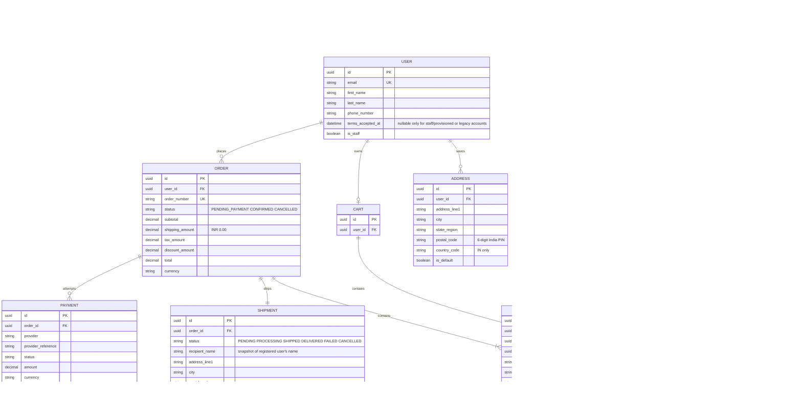

# BookBloom Database Architecture

**Status:** Proposed architecture for review; not an approved implementation contract  
**Source of truth reviewed:** `docs/plan/online-bookstore-requirements.md` and `docs/plan/BookBloom.pdf` (single-page desktop screen composite)  
**Currency:** INR (`INR`, two decimal places) for all catalog and order monetary values  
**Framework versions:** Not specified in the repository; recommendations below are version-neutral Django/DRF patterns.

## 1. Purpose and Scope

This document proposes a relational data model for the BookBloom MVP: customer authentication and account data, a physical-book catalog with paperback and hardcover formats, categories and authors, carts, checkout/orders, shipping, and admin operations. It includes field-level schema details, constraints, relationship cardinalities, lifecycle guidance, and an ER diagram.

This is a design specification, not a migration or application implementation. The current product brief is authoritative for approved policies; Figma is treated as evidence of visible interactions and data displayed, not as authority to invent backend business rules.

## 2. Scope Decisions

### Confirmed requirements

- Purchasing requires an authenticated customer account.
- Books are sold as physical copies in paperback and/or hardcover formats.
- Physical order items need a shipping destination.
- BookBloom serves customers in India only; international shipping addresses are not supported.
- Shipping is free for every order and must be recorded/displayed as INR 0.00.
- Physical stock is required and checkout must prevent purchases exceeding available quantities.
- Accepted payment methods are cards (American Express, Visa, Mastercard) and PayPal.
- Customers and administrators see prices and totals in INR.
- After authoritative order confirmation, customers see an Order Completed screen and receive an order-confirmation email at the email address registered on their account.
- “Order completed” in the customer confirmation UI means checkout/order placement succeeded; it does not mean physical delivery or fulfillment is complete.
- Administrators manage catalog and orders.

### Conflicts, gaps, and conservative recommendations

| Topic | Evidence / issue | Proposed handling pending decision |
| --- | --- | --- |
| Payment provider and lifecycle | Accepted methods are cards (American Express, Visa, Mastercard) and PayPal; provider selection and capture/refund behavior are unspecified. | Persist the selected method and safe provider references/state. Never persist PAN, CVV, payment credentials, or provider secrets. The customer confirmation screen and email are triggered only after authoritative order confirmation. |
| Confirmation email delivery | An order-confirmation email to the registered account email is required; the delivery provider is unspecified. | Dispatch after the confirmation transaction commits, retry transient failures, and make delivery processing idempotent per order-confirmation event. Provider and durable delivery mechanism remain open. |
| Inventory reservation release | Stock tracking and checkout enforcement are required, but exact reservation expiry and release behavior on payment failure/cancellation is unspecified. | Require and transactionally reserve available stock at order creation. Decide the exact release/expiry policy before implementation. |
| Taxes and discounts | Shipping is free; India-specific tax treatment and discounts are not fully defined (coupons are out of MVP scope). | Persist immutable line prices and INR totals. Shipping is always INR 0.00; keep tax policy explicitly India-specific and do not invent rates or calculations. |
| Tracking and fulfillment | Shipping updates/statuses are in scope, but tracking support and lifecycle are open. | Keep a minimal fulfillment status and optional carrier/tracking reference. Tracking data and transitions require operational policy. |
| Cancellation/refund | Open question; payment status in the mockup is not a refund policy. | Do not design customer cancellation/refund mutations until lifecycle and provider behavior are decided. Reserve auditable payment/refund records for provider events if needed. |
| Account profile and registration consent | Registration requires first name, last name, email, phone number, password, password confirmation, and acceptance of Terms & Conditions; dashboard profile details unspecified. | Model required email, names, and validated phone number. Record acceptance with a server-generated `terms_accepted_at`; do not persist password confirmation. Terms document/version tracking remains open unless product requires it. Addresses are separate reusable records, with order-time snapshots. |
| Category values | Figma names example categories; requirement says broad book categories. | Categories are managed data, not a closed code enum; seed examples only if product approves. |
| India address validation | The product is India-only; the precise address-provider/deliverability verification process is unspecified. | Require country code `IN` and validate the Indian PIN format (six digits, first digit 1–9). Do not accept international addresses. |

## 3. Architecture Overview

Use a relational database (PostgreSQL is recommended for production; the exact engine is not specified). Organize Django models by domain ownership, whether as Django apps or modules:

- `authentication`: `User`, `Session`, `PasswordResetToken` (if implemented)
- `accounts`: `CustomerProfile`, `Address`
- `catalog`: `Author`, `Category`, `Book`, `PhysicalVariant`
- `commerce`: `Cart`, `CartItem`, `Order`, `OrderItem`, `Payment`, `Shipment`
Use Django's configured custom user model from the first migration. The authentication module owns identity, credentials, and auth lifecycle. The account module owns profile and saved-address data that are specific to the authenticated customer but not credential storage. Use UUID primary keys for public-facing entities as a recommendation; internal integer keys are also acceptable if the project convention prefers them. Store timestamps that are defined by a model as timezone-aware UTC values; do not add generic creation/update timestamps to every model. Monetary columns should be `DecimalField`, never floating point.

### Catalog structure

`Book` is the shared bibliographic/catalog record. Each purchasable physical format is represented by a `PhysicalVariant` row, with `PAPERBACK` or `HARDCOVER` format, price, and required stock. Each cart/order line points to one physical variant. Prices and descriptive identity are copied into order-item snapshots so catalog edits do not rewrite historical purchases.

### Order structure

`Order` is a transaction aggregate owned by a customer. `OrderItem` snapshots each purchased physical variant, quantity, unit price, and currency. `Order.status=CONFIRMED` means the order placement/payment confirmation succeeded; it does not assert shipment or delivery completion. Physical fulfillment is tracked independently by `Shipment`, which stores an immutable delivery contact and address snapshot. “Order Completed” is the customer confirmation-screen label, not a persisted fulfillment state.

### Payment boundary

Accepted methods are card (`AMEX`, `VISA`, `MASTERCARD`) and PayPal. Payment details are provider-owned. The application stores amount, currency, provider identifier/reference, state, selected method, and safe display metadata only. A payment success is established by a verified provider callback or server-to-server confirmation, not by the browser redirect. Never store PAN, CVV, PayPal credentials, provider credentials, or raw payment secrets. Provider selection and capture/refund behavior remain open.

### Quick-copy data model

**Core entities:** `User`, `Address`, `Author`, `Category`, `Book`, `BookCategory`, `PhysicalVariant`, `Cart`, `CartItem`, `Order`, `OrderItem`, `Shipment`, and `Payment`.

**Fields and keys** (`?` = optional; `PK` = primary key; `FK` = foreign key; `UK` = unique):

- `User`: `id UUID PK`; `email EmailField UK`; `first_name, last_name CharField(150)`; `phone_number CharField(32)`; `password EncodedPassword`; `terms_accepted_at DateTimeField?`; `is_staff BooleanField`; `date_joined DateTimeField`.
- `Address`: `id UUID PK`; `user_id UUID FK → User`; `label CharField(40)?`; `company CharField(200)?`; `address_line1, address_line2 CharField(255)` (`address_line2` optional); `city, state_region CharField(120)`; `postal_code CharField(6)`; `country_code CharField(2)`; `phone CharField(32)`; `is_default BooleanField`; `created_at, updated_at DateTimeField`.
- `Author`: `id UUID PK`; `name CharField(200)`.
- `Category`: `id UUID PK`; `name CharField(100)`; `slug SlugField(120) UK`; `parent_id UUID FK → Category?`; `is_active BooleanField`.
- `Book`: `id UUID PK`; `author_id UUID FK → Author`; `title CharField(300)`; `slug SlugField(320) UK`; `description TextField?`; `isbn_10 CharField(10)? UK`; `isbn_13 CharField(13)? UK`; `cover_image ImageField/storage key?`; `rating DecimalField(2,1)?`; `status CharField(16)`; `published_at DateTimeField?`; `created_at, updated_at DateTimeField`.
- `BookCategory`: `id UUID PK`; `book_id UUID FK → Book`; `category_id UUID FK → Category`; unique `(book_id, category_id)`.
- `PhysicalVariant`: `id UUID PK`; `book_id UUID FK → Book`; `format CharField(16)`; `price DecimalField(12,2)`; `currency CharField(3)`; `stock_quantity PositiveIntegerField`; `is_available BooleanField`; `updated_at DateTimeField`; unique `(book_id, format)`.
- `Cart`: `id UUID PK`; `user_id UUID FK → User, UK`; `updated_at DateTimeField`.
- `CartItem`: `id UUID PK`; `cart_id UUID FK → Cart`; `physical_variant_id UUID FK → PhysicalVariant`; `quantity PositiveSmallIntegerField`; unique `(cart_id, physical_variant_id)`.
- `Order`: `id UUID PK`; `order_number CharField(32) UK`; `user_id UUID FK → User`; `status CharField(20)`; `currency CharField(3)`; `subtotal, shipping_amount, tax_amount, discount_amount, total DecimalField(12,2)`; `placed_at, confirmed_at DateTimeField?`; `created_at DateTimeField`.
- `OrderItem`: `id UUID PK`; `order_id UUID FK → Order`; `book_id UUID FK → Book`; `physical_variant_id UUID FK → PhysicalVariant`; `title_snapshot CharField(300)`; `format_snapshot CharField(20)`; `quantity PositiveSmallIntegerField`; `unit_price, line_total DecimalField(12,2)`; `currency CharField(3)`.
- `Shipment`: `id UUID PK`; `order_id UUID FK → Order, UK`; `status CharField(20)`; `recipient_name CharField(200)`; `company CharField(200)?`; `address_line1, address_line2 CharField(255)` (`address_line2` optional); `city, state_region CharField(120)`; `postal_code CharField(6)`; `country_code CharField(2)`; `phone CharField(32)`; `carrier CharField(100)?`; `tracking_reference CharField(200)?`; `shipped_at, delivered_at DateTimeField?`; `created_at, updated_at DateTimeField`.
- `Payment`: `id UUID PK`; `order_id UUID FK → Order`; `provider CharField(40)`; `provider_reference CharField(200)?` (unique per provider when set); `status CharField(20)`; `amount DecimalField(12,2)`; `currency CharField(3)`; `method_type CharField(30)`; `method_brand CharField(30)?`; `last_four CharField(4)?`; `idempotency_key UUID UK`; `failure_code CharField(100)?`; `created_at, updated_at DateTimeField`.

**Relationships:** `User 1—many Address`; `User 1—0..1 Cart`; `Cart 1—many CartItem`; `PhysicalVariant 1—many CartItem`; `Author 1—many Book`; `Book many—many Category` through `BookCategory`; `Book 1—many PhysicalVariant`; `User 1—many Order`; `Order 1—many OrderItem`; each `OrderItem` references one `Book` and one `PhysicalVariant` belonging to that book; `Order 1—1 Shipment`; `Order 1—many Payment` attempts.

## 4. Django Schema Specification

Notation: `required` means `null=False`; `optional` means nullable where appropriate. Timestamp fields are included only where their creation or change time supports an application or operational need. Types refer to Django model fields. Defaults are recommendations.

### 4.1 User (Authentication Module)

Purpose: authenticated customer and staff identity. The authentication module owns credential lifecycle, login state, and identity validation. For the current application schema, keep `is_staff` as the server-managed staff marker and use Django groups/permissions for specific administrative capabilities. Do not add `is_active` or `is_superuser` fields to this model, or expose staff status as a customer-editable role flag.

| Field | Type | Required/default | Rules |
| --- | --- | --- | --- |
| `id` | `UUIDField` | required, UUID4 | Primary key recommendation. |
| `email` | `EmailField` | required | Unique case-insensitively; normalize before save. Use as login identifier if approved. |
| `first_name` | `CharField(150)` | required | Registration name. |
| `last_name` | `CharField(150)` | required | Registration name. |
| `phone_number` | `CharField(32)` | required | Registration contact number. Validate and normalize to E.164 using a phone-number validation library; retain the leading `+` in storage. Exact accepted regions/format policy is not specified. |
| `password` | Django auth password field | required | Store only the encoded hash produced by Django's password hashing APIs (`set_password()`/`create_user()`); never store or serialize plaintext. |
| `terms_accepted_at` | `DateTimeField` | required for self-registered customer accounts; server-set | UTC-aware timestamp recorded only after the request explicitly accepts the Terms & Conditions. It is acceptance evidence, not a client-supplied timestamp. It may be nullable for staff/provisioned or legacy accounts that did not use customer registration; customer registration must always populate it. |
| `is_staff` | `BooleanField` | default `False` | Admin-site access; protected, server-managed. |
| `date_joined` | `DateTimeField` | `timezone.now` | UTC-aware. |

Registration request validation (serializer/service; not additional `User` columns): require `first_name`, `last_name`, `email`, `phone_number`, `password`, `password_confirmation`, and a true `terms_accepted` value. Reject missing/false acceptance and mismatched passwords before creating the account. `password_confirmation` is request-only: compare it with `password`, then discard it; never persist it, hash it separately, or include it in responses/logs. Set `terms_accepted_at` on the server when account creation succeeds. Validate phone syntax and normalize before persistence; do not claim phone ownership verification unless a separate product requirement defines a verification flow.

Constraints/indexes: unique normalized email. Use a database functional unique constraint on `Lower(email)` if supported by the configured engine, plus application normalization. Validate phone number syntax and E.164 normalization in the registration serializer/service; database storage length is not a substitute for validation. Django groups/permissions are the authorization source. Preserve existing email/login and email-verification/password-reset conventions: use Django's secure token workflow or a dedicated expiring, hashed-token table only if product requirements require persisted tokens; this registration change does not add an OTP flow.

Deletion: do not cascade-delete financial order history with a user. Account anonymization and retention policy are operational/legal decisions; this schema does not add an `is_active` field for account deactivation.

### 4.2 Address (Account Module)

Purpose: customer's reusable shipping address and saved account details. There is no gift or alternate-recipient option in the current scope; checkout uses the registered user's name as the delivery recipient and copies it with the address into the shipment snapshot.

| Field | Type | Required/default | Rules |
| --- | --- | --- | --- |
| `id` | `UUIDField` | required | Primary key. |
| `user` | `ForeignKey(User)` | required | `CASCADE`; owned address. |
| `label` | `CharField(40)` | optional | e.g. Home; UI convenience only. |
| `company` | `CharField(200)` | optional | UI marks optional. |
| `address_line1` | `CharField(255)` | required | Street/address. |
| `address_line2` | `CharField(255)` | optional | Apartment/unit. |
| `city` | `CharField(120)` | required |  |
| `state_region` | `CharField(120)` | required | Indian state/union territory name; use textual storage unless an approved canonical list is adopted. |
| `postal_code` | `CharField(6)` | required | Indian PIN; validate exactly six ASCII digits with first digit 1–9 (`^[1-9][0-9]{5}$`). This checks format, not postal deliverability. |
| `country_code` | `CharField(2)` | required, default `IN` | ISO 3166-1 alpha-2; database check constraint requires exactly `IN`. No international addresses. |
| `phone` | `CharField(32)` | required | Contact phone; the supported shipping geography is India. Detailed phone normalization is not specified. |
| `is_default` | `BooleanField` | default `False` | At most one default per user. |
| `created_at`, `updated_at` | `DateTimeField` | auto | UTC-aware; saved addresses can be created and edited over time. |

Constraints/indexes: check `country_code = 'IN'`; validate PIN format in serializer/model validation (and use a database check where supported); index `(user, is_default)`; unique conditional `(user)` where `is_default=True` if the DB supports partial unique constraints. A transaction must unset the previous default and set the new one atomically.

Deletion: `CASCADE` with user for reusable address data, subject to account retention policy. `Order`/`Shipment` must not reference this mutable address as the sole historical record.

### 4.3 Author

Purpose: normalized author record. For the current scope, each book has exactly one author; support for multiple contributors and roles is out of scope.

| Field | Type | Required/default | Rules |
| --- | --- | --- | --- |
| `id` | `UUIDField` | required | Primary key. |
| `name` | `CharField(200)` | required | Display name. |

Constraint: unique normalized name is optional; avoid enforcing if duplicate names/aliases are valid. For the current scope, each `Book` has exactly one `Author`, referenced by a required foreign key on `Book`; one author may be referenced by multiple books. Additional contributor roles are out of scope.

### 4.4 Category

Purpose: browse/filter taxonomy.

| Field | Type | Required/default | Rules |
| --- | --- | --- | --- |
| `id` | `UUIDField` | required | Primary key. |
| `name` | `CharField(100)` | required | Human-readable name. |
| `slug` | `SlugField(120)` | required | Unique. |
| `parent` | `ForeignKey(Category)` | optional | `SET_NULL`; supports hierarchy, if needed. |
| `is_active` | `BooleanField` | default `True` | Hidden/inactive category behavior to be defined. |

Constraints/indexes: unique `slug`; index `(parent, is_active)`. Categories such as Kids, Fiction, Romance, Literature, Mystery & Thrillers are design examples, not immutable choices.

### 4.5 Book

Purpose: bibliographic/catalog record for a physical book offered in paperback and/or hardcover format. Catalog star ratings are stored independently on this record; they are not customer-written reviews.

| Field | Type | Required/default | Rules |
| --- | --- | --- | --- |
| `id` | `UUIDField` | required | Primary key. |
| `title` | `CharField(300)` | required |  |
| `slug` | `SlugField(320)` | required | Unique, stable URL identifier. |
| `description` | `TextField` | optional |  |
| `isbn_10` | `CharField(10)` | optional | Normalize; format validation; unique when non-null. |
| `isbn_13` | `CharField(13)` | optional | Normalize/check digit; unique when non-null. |
| `cover_image` | `ImageField` or storage key | optional | Public display media; storage provider not specified. |
| `rating` | `DecimalField(2,1)` | optional (`null=True`, `blank=True`) | Catalog star-rating value from `0.0` through `5.0`; one decimal place. `NULL` means no catalog rating is available. The source and maintenance process are unresolved. |
| `status` | `CharField(16)` | default `DRAFT` | `DRAFT`, `PUBLISHED`, `ARCHIVED`; client/customer cannot set. |
| `published_at` | `DateTimeField` | optional | Catalog publication date, not product release date unless clarified. |
| `created_at`, `updated_at` | `DateTimeField` | auto | Useful for catalog management and tracking edits. |

Relationships: each book has exactly one author through a required `ForeignKey(Author, on_delete=PROTECT)`; an author may be associated with zero or more books. Books have a many-to-many relationship with `Category` through `BookCategory`, which should use `ForeignKey(Book, on_delete=CASCADE)` and `ForeignKey(Category, on_delete=PROTECT)`; `BookCategory` has unique `(book, category)`.

Constraints/indexes: unique slug; unique conditional ISBN fields; `CheckConstraint(rating IS NULL OR 0 <= rating <= 5)`; index `(status, published_at)`; consider `(status, rating)` for published catalog filtering/sorting, subject to query-plan validation. Full-text/search indexes are engine-specific and should match the actual title/author/category search requirements. The catalog query must support filtering to the requested 1–5 star options and sorting by rating; because stored ratings may have one decimal place, define and document bucket boundaries for fractional values before exposing those filters. Use explicit null ordering for rating sorts so unrated books behave consistently.

Deletion: use archive (`status=ARCHIVED`) rather than hard-delete when order lines exist. Variant deletion should be blocked if it has historical order lines.

### 4.6 PhysicalVariant

Purpose: purchasable physical format, either paperback or hardcover.

| Field | Type | Required/default | Rules |
| --- | --- | --- | --- |
| `id` | `UUIDField` | required | Primary key. |
| `book` | `ForeignKey(Book)` | required | `PROTECT`; catalog identity retained. |
| `format` | `CharField(16)` | required | `PAPERBACK`, `HARDCOVER`; values are supported by Figma. |
| `price` | `DecimalField(12,2)` | required | Must be `>= 0`; INR policy applies. |
| `currency` | `CharField(3)` | default `INR` | ISO 4217; enforce `INR` for MVP unless multi-currency is approved. |
| `stock_quantity` | `PositiveIntegerField` | required; no implicit default | Required nonnegative count of units currently available to sell; admin must provide it for every enabled physical format. |
| `is_available` | `BooleanField` | default `True` | Admin-managed sellability; not equivalent to stock. |
| `updated_at` | `DateTimeField` | auto-updated | Tracks changes to price, stock, or availability; creation time is not independently needed. |

Constraints: unique `(book, format)` unless multiple editions/ISBNs per format are required; `price >= 0`; `stock_quantity >= 0`. Index `(is_available, format, price)` for catalog filters. Customer-facing availability requires both admin-managed `is_available=True` and `stock_quantity > 0`; catalog results and cart/checkout validation must use this rule. Checkout must reject quantities greater than current stock.

### 4.7 Cart and CartItem

Purpose: persistent customer's current shopping cart; cart is not an order and its prices are not purchase-time facts.

#### Cart

| Field | Type | Required/default | Rules |
| --- | --- | --- | --- |
| `id` | `UUIDField` | required | Primary key. |
| `user` | `OneToOneField(User)` | required | `on_delete=CASCADE`; one cart per registered customer. |
| `updated_at` | `DateTimeField` | auto | UTC-aware; refresh when cart contents change. |

One active cart per customer is recommended. Anonymous carts are out of scope.

#### CartItem

| Field | Type | Required/default | Rules |
| --- | --- | --- | --- |
| `id` | `UUIDField` | required | Primary key. |
| `cart` | `ForeignKey(Cart)` | required | `on_delete=CASCADE`. |
| `physical_variant` | `ForeignKey(PhysicalVariant)` | required | `on_delete=PROTECT`; the selected paperback or hardcover variant. |
| `quantity` | `PositiveSmallIntegerField` | default `1` | Apply `MinValueValidator(1)`, validate in serializers/model validation, and enforce `CheckConstraint(quantity >= 1)`. The positive integer field alone does not enforce a minimum of one. |

Constraints and indexes: unique `(cart, physical_variant)`; `CheckConstraint(quantity >= 1)`. Product availability and current price are revalidated during checkout; never trust client-supplied price or total. Cart merge/expiry is not needed if registered-only carts are strictly enforced.

### 4.8 Order

Purpose: immutable commercial record for a customer's placed order.

| Field | Type | Required/default | Rules |
| --- | --- | --- | --- |
| `id` | `UUIDField` | required | Primary key. |
| `order_number` | `CharField(32)` | required | Unique, non-sequential opaque human reference recommended. |
| `user` | `ForeignKey(User)` | required | `PROTECT`; avoid cascade deletion. Any later anonymization must be an explicit retention workflow. |
| `status` | `CharField(20)` | default `PENDING_PAYMENT` | States: `PENDING_PAYMENT`, `CONFIRMED`, `CANCELLED`. `CONFIRMED` means order placement/payment confirmation succeeded, not shipment completion. Physical fulfillment is represented by `Shipment.status`; do not add an order-level `COMPLETED` fulfillment state. A failed payment attempt does not add an order state. Refund state should be separate if supported. |
| `currency` | `CharField(3)` | default `INR` | Immutable order currency. |
| `subtotal` | `DecimalField(12,2)` | required | Snapshot from line totals; server-calculated. |
| `shipping_amount` | `DecimalField(12,2)` | required, default `0.00` | Always INR 0.00 for every order; persist and include as a separate line in displayed order totals. Enforce `shipping_amount = 0.00`. |
| `tax_amount` | `DecimalField(12,2)` | required, default `0.00` | Server-calculated snapshot; India-specific tax policy and whether/how tax applies remain open. Do not infer the zero default as a tax decision. |
| `discount_amount` | `DecimalField(12,2)` | default `0.00` | Provisional field; no coupons in MVP scope. |
| `total` | `DecimalField(12,2)` | required | Server-calculated; check `>=0`, currency consistent. |
| `placed_at` | `DateTimeField` | optional | Set when order is created/placed, distinct from creation if payment pending. |
| `confirmed_at` | `DateTimeField` | optional | Set only after authoritative payment confirmation. |
| `created_at` | `DateTimeField` | auto | Used to order and inspect placed orders; `placed_at` and `confirmed_at` capture distinct business events. |

Constraints/indexes: unique order number; check monetary fields non-negative and `shipping_amount = 0.00`; indexes `(user, -created_at)` and `(status, -created_at)`. `total` is server-calculated from `subtotal + shipping_amount + tax_amount - discount_amount`; shipping therefore contributes exactly INR 0.00 and remains visible in order summaries. Order status transitions must be performed by domain services, not direct general-purpose serializer writes.

Transitions: a failed payment attempt updates only its `Payment` row, leaving the order `PENDING_PAYMENT` and eligible for another attempt. A later verified provider success for any valid attempt on that same order may transition `PENDING_PAYMENT -> CONFIRMED`; do not require a new order after a failed attempt. `CONFIRMED -> CANCELLED` is subject to the unresolved cancellation policy. Fulfillment progress and completion belong to `Shipment.status` (including `DELIVERED`), not `Order.status`. Only server-side domain services may transition order status after validating authoritative provider/operational events; never accept status from customer request serializers. Payment/refund state is separately tracked. The customer may see “Order Completed” upon confirmation even while the shipment remains pending or in transit.

### 4.9 OrderItem

Purpose: immutable snapshot of one purchased physical-book format variant.

| Field | Type | Required/default | Rules |
| --- | --- | --- | --- |
| `id` | `UUIDField` | required | Primary key. |
| `order` | `ForeignKey(Order)` | required | `PROTECT`; finalized order history must not be removed by ORM cascade. Clean up abandoned drafts through an explicit service/policy. |
| `book` | `ForeignKey(Book)` | required | `PROTECT`; historical catalog identity; must be the same book referenced by `physical_variant.book`. |
| `physical_variant` | `ForeignKey(PhysicalVariant)` | required | `PROTECT`; the purchased paperback or hardcover variant; its `book_id` must equal this row's `book_id`. |
| `title_snapshot` | `CharField(300)` | required | At-time-of-purchase title. |
| `format_snapshot` | `CharField(20)` | required | `PAPERBACK` or `HARDCOVER`; stable historical display. |
| `quantity` | `PositiveSmallIntegerField` | required | Number of physical copies. |
| `unit_price` | `DecimalField(12,2)` | required | Snapshot, non-negative. |
| `currency` | `CharField(3)` | required | Snapshot; must match order currency. |
| `line_total` | `DecimalField(12,2)` | required | `unit_price * quantity` at checkout; server calculated. |

Validation: model `clean()` must reject a row unless `book_id == physical_variant.book_id`; the checkout/order-creation service must perform this validation for every line before persistence (including when constructing snapshots), rather than trusting separate client/catalog identifiers. Ordinary SQL check constraints cannot compare columns across the referenced tables, so enforce this cross-table invariant in that validation path; keep both FKs protected. Use `MinValueValidator(1)` for `quantity` and enforce `quantity >= 1` with a database `CheckConstraint`, in addition to serializer/model validation. Constraints: `CheckConstraint(quantity >= 1)`; `unit_price >= 0`; `line_total >= 0`; index `(order, id)`. Do not require uniqueness per variant at order level; checkout may consolidate duplicate cart lines before creating rows.

### 4.10 Shipment

Purpose: required physical fulfillment destination/status snapshot. Every purchase is a physical-book order and checkout requires a shipping address, so each order has exactly one shipment in the MVP one-destination proposal. A future split-shipment policy would require a deliberate cardinality change.

| Field | Type | Required/default | Rules |
| --- | --- | --- | --- |
| `id` | `UUIDField` | required | Primary key. |
| `order` | `OneToOneField(Order)` | required | `PROTECT`; every order has exactly one shipment, created with the order and address snapshot at checkout; shipment history must not be silently removed with an order. |
| `status` | `CharField(20)` | default `PENDING` | `PENDING`, `PROCESSING`, `SHIPPED`, `DELIVERED`, `FAILED`, `CANCELLED`; transitions need fulfillment policy. |
| `recipient_name` | `CharField(200)` | required | Snapshot of the registered user's `first_name` and `last_name` at checkout; no alternate recipient is supported. |
| `company` | `CharField(200)` | optional | Snapshot. |
| `address_line1` | `CharField(255)` | required | Snapshot. |
| `address_line2` | `CharField(255)` | optional | Snapshot. |
| `city` | `CharField(120)` | required | Snapshot. |
| `state_region` | `CharField(120)` | required | Snapshot. |
| `postal_code` | `CharField(6)` | required | Indian PIN snapshot; exactly six ASCII digits, first digit 1–9. |
| `country_code` | `CharField(2)` | required, default `IN` | Snapshot; check constraint requires `IN`. International destinations are rejected at checkout. |
| `phone` | `CharField(32)` | required | Snapshot. |
| `carrier` | `CharField(100)` | optional | Tracking provider policy open. |
| `tracking_reference` | `CharField(200)` | optional | Sensitive enough to keep owner/admin-only. |
| `shipped_at`, `delivered_at` | `DateTimeField` | optional | Set by authorized operational action/provider event. |
| `created_at`, `updated_at` | `DateTimeField` | auto | Supports fulfillment queue ordering and tracks the latest shipment change. |

Constraints/indexes: check `country_code = 'IN'`; validate the PIN format in the checkout path (and use a database check where supported); index `(status, created_at)`; optional unique `(carrier, tracking_reference)` when both present. Create the required shipment atomically with every order at checkout, using the required selected India address; do not permit order confirmation/fulfillment if shipment creation or address validation fails.

Personal address snapshots require retention/access controls and must never be exposed to unrelated customers.

### 4.11 Payment

Purpose: provider-neutral payment attempt/transaction record. Multiple rows support retries and asynchronous callbacks.

| Field | Type | Required/default | Rules |
| --- | --- | --- | --- |
| `id` | `UUIDField` | required | Primary key. |
| `order` | `ForeignKey(Order)` | required | `PROTECT`. |
| `provider` | `CharField(40)` | required | E.g. configured provider identifier; provider selection unresolved. |
| `provider_reference` | `CharField(200)` | optional | Unique per provider when non-null. |
| `status` | `CharField(20)` | default `INITIATED` | `INITIATED`, `REQUIRES_ACTION`, `AUTHORIZED`, `CAPTURED`, `FAILED`, `CANCELLED`, `PARTIALLY_REFUNDED`, `REFUNDED`. Final states subject to provider. |
| `amount` | `DecimalField(12,2)` | required | Non-negative; provider-confirmed amount. |
| `currency` | `CharField(3)` | required | Must match order. |
| `method_type` | `CharField(30)` | required | Choices: `CARD`, `PAYPAL`; accepted methods are fixed by product requirements. |
| `method_brand` | `CharField(30)` | conditional | Required for `CARD`: `AMEX`, `VISA`, or `MASTERCARD`; must be `NULL` for `PAYPAL`. Enforce the method/brand combination. |
| `last_four` | `CharField(4)` | optional | Only if provider returns and policy approves. |
| `idempotency_key` | `UUIDField` | required | Unique per payment initiation, prevents duplicate charges on retry. |
| `failure_code` | `CharField(100)` | optional | Sanitized provider code, not raw secret payload. |
| `created_at`, `updated_at` | `DateTimeField` | auto | Orders payment attempts and tracks asynchronous provider status changes. |

Constraints/indexes: unique `(provider, provider_reference)` where provider reference non-null; unique `idempotency_key`; `(order, created_at)`; amount non-negative; choices/check constraint for `method_type` and `method_brand` (`CARD` requires one allowed brand; `PAYPAL` requires no brand). Store provider webhook event IDs in a separate deduplication table if provider callbacks are used. Never store PAN, CVV, provider credentials, or unredacted webhook secrets/payloads.

## 5. Relationships and Cardinality

- A user owns zero or more saved addresses, one active cart, and zero or more orders.
- A cart contains zero or more cart items; each cart item references one required physical variant.
- Each book has exactly one author and zero or more categories, and zero or one physical variant per supported format.
- An order has one or more order items; each item snapshots one required physical variant.
- Every physical-only order has exactly one required shipment; checkout requires and snapshots a shipping address.
- An order can have multiple payment attempts.

## 6. Mermaid ER Diagram

Mermaid note: Cart and order items have required physical-variant links; `OrderItem.book` must match `OrderItem.physical_variant.book` and is checked during order-line validation and creation. Every order has exactly one shipment, created with its required India address snapshot in the checkout transaction. Address and shipment country codes are constrained to `IN`; their PINs use India's six-digit format. `Order.shipping_amount` is constrained to INR 0.00.

## 7. Constraint, Index, and Query Summary

| Area | Important constraint/index/query |
| --- | --- |
| Authentication & Accounts | Unique normalized email; required validated/normalized `phone_number`; customer self-registration requires explicit true Terms acceptance and server-populated `terms_accepted_at`; password confirmation is request-only; address country check `country_code = 'IN'`; Indian PIN format validation (six digits, first digit 1–9); address lookup by `(user, is_default)`; one default address per user. |
| Catalog | Unique book slug/ISBN; indexes by publication status; `Book.rating` nullable decimal constrained to 0.0–5.0; consider `(status, rating)` for rating filters/sorts and verify with query plans; explicitly order null ratings; define fractional-value star-filter buckets; required nonnegative variant stock; customer availability requires `is_available` and stock greater than zero; author/category join indexes; full-text search title + author names + category as engine permits. |
| Cart | Unique active cart per user; one item per physical variant per cart; `MinValueValidator(1)` plus `CheckConstraint(quantity >= 1)`; fetch cart and items in a bounded query. |
| Orders | Unique opaque order number; indexes by user/date and status/date; order lines immutable after confirmation; order-line quantity has `MinValueValidator(1)` plus `CheckConstraint(quantity >= 1)`; each line's book matches its physical variant at validation and creation; totals calculated server-side; shipping is always INR 0.00 and included in the total. |
| Payment | `method_type` is `CARD` or `PAYPAL`; card brand is `AMEX`, `VISA`, or `MASTERCARD`, while PayPal has no card brand; unique provider reference and idempotency key; callback deduplication; amount/currency validation against order. |
| Fulfillment | Shipment status/date index; private tracking reference; each physical-only order requires exactly one shipment and checkout address snapshot. |

## 8. Transaction and Concurrency Boundaries

### Checkout/order placement

Perform checkout in one database transaction:

1. Lock the user's cart and every requested `PhysicalVariant` row with `select_for_update`, in deterministic primary-key order to reduce deadlocks.
2. Re-fetch authoritative availability and prices; reject stale/unavailable items or any quantity exceeding `stock_quantity` with item-specific errors. Verify `is_available=True` and sufficient stock.
3. Validate the required selected shipping address has country code `IN` and a valid six-digit Indian PIN.
4. Atomically decrement each variant's available `stock_quantity` by the ordered quantity as a reservation, and create the pending order, its required shipment/address snapshot, immutable item snapshots, and payment attempt in the same transaction. Any failure rolls back both order creation and stock decrements. Validate each order line's book against `physical_variant.book` and calculate totals with `Decimal` and a fixed INR 0.00 shipping amount; apply India tax or discounts only under an approved policy.
5. Commit before contacting a payment provider where possible; do not hold database locks over external calls. Use a unique idempotency key per payment attempt and a persisted payment-intent workflow if provider calls require durable coordination.
6. Clear or mark cart items according to payment initiation semantics. The exact reservation expiry/release behavior on payment failure or order cancellation is not defined; it must be decided before implementation. Preserve the pending order/payment attempt for retry as described above.

Do not hold a database transaction open over slow external payment calls. Payment webhooks must be signature-verified, deduplicated by provider event ID, and idempotently update payment/order state.

### Payment confirmation

In a transaction, verify the provider event and amount/currency/reference, then update that payment attempt and transition the eligible order from `PENDING_PAYMENT` to `CONFIRMED`, setting `confirmed_at`. A verified successful attempt may confirm its still-pending order even if an earlier attempt failed; a failed attempt does not change order status. The customer confirmation screen and order-confirmation email must not be shown or dispatched based only on checkout submission, a browser redirect, or an unverified callback. They follow only authoritative order confirmation. Apply order transitions only in the server-side domain service, never from client-supplied status. Order confirmation is an order-state transition recorded on the order; shipment status and timestamps independently record fulfillment progress.

After the confirmation transaction commits, dispatch an order-confirmation email to the registered `User.email` and make the customer confirmation screen available. Use a post-commit hook/task enqueue so no email is sent for a rolled-back confirmation. Retry transient delivery failures without changing order or payment state. Make processing idempotent using a stable key derived from the order and confirmation event; use provider-side idempotency where supported. Email delivery is at-least-once unless the selected provider/dispatch mechanism supports stronger deduplication. If durable enqueue/retry across process failure is required, use a transactional outbox or equivalent persisted work record; this is an implementation reliability choice, not a generic notification feature or a required `Notification` model. Email provider, queue, and delivery guarantees remain open decisions. Email failure must not undo a confirmed order or block access to the confirmation screen.

### Inventory reservation

Inventory is mandatory. `stock_quantity` is the number of units currently available to sell; checkout reserves by decrementing it under row locks in the same transaction that creates the pending order. Concurrent checkouts therefore serialize on each variant and cannot reserve more than its available quantity. A conditional update (`stock_quantity >= requested_quantity`) is an alternative, provided every affected row is checked and all order/stock writes remain atomic. The exact reservation expiry and release/restock behavior after payment failure or cancellation remains open; do not implement an assumed timeout or release transition. Backorders are not in scope unless separately approved.

## 9. Privacy, Security, and Retention

- Use Django password hashing and standard authentication/session or token security. Never return password hashes or auth secrets.
- Registration must validate all required fields, reject mismatched password confirmation and missing/false Terms acceptance, and normalize/validate `phone_number` before creating the account. Use Django's password hashing API; password confirmation is request-only and must not be persisted, returned, or logged.
- Set `terms_accepted_at` server-side only after explicit acceptance. Do not trust a client timestamp. Store no Terms content or redundant acceptance boolean unless a later audit/versioning requirement justifies it; Terms document/version tracking is an open question.
- Apply object-level ownership checks to carts, orders, and addresses. Admin access must be separately permissioned and audited.
- Do not store payment card PAN/CVV or provider credentials. Minimize provider metadata and sanitize errors.
- Protect address, phone, order, and tracking data from public catalog APIs. Restrict to owner and authorized fulfillment staff.
- Define account deletion/anonymization and order retention periods before launch. Financial and shipping records may need retention while personal profile access is removed; this is a legal/operational decision, not inferred here.
- Add audit logging for admin catalog changes, order status transitions, and access to protected files/PII. Avoid logging raw request bodies or secrets.
- Rate-limit registration/login and payment initiation.

## 10. Requirements-to-Data Traceability

| Requirement / screen evidence | Persistent data and rules |
| --- | --- |
| Authentication module registration (registration page fields: first name, last name, email, phone number, password, confirm password, required Terms checkbox) | `User.first_name`, `last_name`, normalized unique `email`, validated `phone_number`, Django-hashed `password`, and server-recorded `terms_accepted_at`. Registration request validation requires a true acceptance value and matching password confirmation; confirmation is request-only and never persisted. Preserve existing email/login and email verification/password-reset conventions; no OTP flow is inferred. Terms document/version tracking remains open. |
| Authentication + account module login/profile | `User`; unique normalized email and stored validated phone number; Django auth-managed password. Login continues to use the established email/auth convention. Account module data such as saved addresses and profile preferences live alongside, but not in, the credential record. |
| Physical-book catalog, search, filters, book detail; 1–5 star display, rating filtering and sorting | `Book.rating` stores an optional catalog rating independently from customer-written reviews; `Book` has exactly one `Author`, with `Category`, `BookCategory`, and `PhysicalVariant`; availability and prices are server-owned. Rating source/maintenance and fractional-value filter bucket semantics remain unresolved. |
| Physical-book cart | `Cart`, `CartItem`; each line references a physical format variant. |
| Checkout and order history | `Order`, `OrderItem`; immutable price/title/format/currency snapshots. |
| Successful checkout / Order Completed confirmation screen | `Order.status=CONFIRMED` and `Order.confirmed_at`; show only after authoritative confirmation. “Order Completed” means order placement/payment confirmation succeeded, not physical delivery or fulfillment completion; `Shipment.status` tracks fulfillment independently. |
| Order confirmation email | Post-commit side effect addressed to the registered `User.email`, triggered only by authoritative transition to `Order.status=CONFIRMED`; retry transient failures and deduplicate per confirmation event. No notification persistence entity is required. Delivery provider and durable dispatch mechanism remain open. |
| Physical address and saved addresses | `Address` for reusable data; `Shipment` for immutable delivery snapshot. |
| Address & payment / checkout screens | `Address`, `Shipment`, `Payment`, `Order`; India-only country `IN`, six-digit PIN validation, accepted methods `CARD` (`AMEX`, `VISA`, `MASTERCARD`) and `PAYPAL`; never store PAN, CVV, or provider credentials. Provider choice and capture/refund behavior remain open. |
| Cart and checkout availability | Required `PhysicalVariant.stock_quantity`; catalog shows purchasability only when enabled and stock is positive; checkout atomically reserves requested units under row locks and rejects insufficient stock. Reservation release/expiry after failure or cancellation remains open. |
| Order summary and checkout totals | `Order.subtotal`, `shipping_amount`, `tax_amount`, `discount_amount`, `total`; shipping is persisted as INR 0.00 and shown on every order total. India tax treatment/rates/rounding remain open; discounts/coupons are outside MVP unless approved. |
| Admin catalog/order management | Django staff/groups/permissions over catalog and order data; audit records recommended. |
| Admin stock and shipment status UI | Required `PhysicalVariant.stock_quantity`, `Shipment.status`; fulfillment transitions and tracking policy remain open. |

## 11. Decisions Required Before Implementation

1. Select payment provider(s) for the approved card brands and PayPal; define capture/refund model and webhook behavior. The accepted methods are not open.
2. Define exact stock-reservation expiry and release/restock behavior on payment failure and order cancellation. Stock tracking and oversell prevention are required; backorders are not in scope unless approved.
3. Define India-specific tax applicability, calculation, inclusion, and rounding; retain discounts/coupons as out of MVP unless product scope changes. Shipping is free for all orders and is not an open decision.
4. Decide whether an order can ship to multiple addresses or split across shipments; this determines whether shipment is one-to-one with order.
5. Define cancellation/refund lifecycle, order status transitions, and who may perform each transition.
6. Decide whether Indian PIN/address validation should include an external postal deliverability check beyond the required six-digit format. International destinations remain unsupported.
7. Define user/order/address retention and account deletion/anonymization policy.
8. Confirm whether a book may have multiple categories/authors and whether physical editions need ISBN-level variant identity.
9. Decide how catalog star ratings are sourced and maintained (for example, admin-entered, imported, or derived from another approved source). Define fractional-rating display/filter bucket behavior as well.
10. Select the order-confirmation email provider and dispatch mechanism, including operational delivery/retry guarantees. The required recipient is the account's registered `User.email`; sending occurs only after authoritative order confirmation.
11. Decide whether Terms & Conditions acceptance must be tied to a specific document version and, if so, how that version is identified and retained. Until decided, store the acceptance timestamp only; do not invent a `terms_version` field or versioning policy.

## 12. Validation Notes

The ER diagram and field definitions are intended to align. Registration validation and the `User` fields now reflect the required names, email, phone number, password, confirmation, and Terms acceptance; password confirmation is request-only and acceptance time is server-recorded. Before implementation, validate the proposed cardinalities against decisions above, especially multiple shipment destinations and payment lifecycle. The approved India-only geography, required stock tracking, free shipping, accepted payment methods, and post-confirmation customer UI/email behavior are reflected throughout. No Django project/configuration or model code is present in the inspected workspace, so this document cannot be validated against concrete Django/DRF versions or migrations yet.
