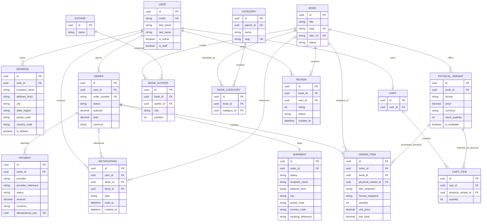

# BookBloom Database Architecture

**Status:** Proposed architecture for review; not an approved implementation contract  
**Source of truth reviewed:** `docs/plan/online-bookstore-requirements.md` and `docs/plan/BookBloom.pdf` (single-page desktop screen composite)  
**Currency:** INR (`INR`, two decimal places) for all catalog and order monetary values  
**Framework versions:** Not specified in the repository; recommendations below are version-neutral Django/DRF patterns.

## 1. Purpose and Scope

This document proposes a relational data model for the BookBloom MVP: customer accounts, a physical-book catalog with paperback and hardcover formats, categories and authors, carts, checkout/orders, shipping, reviews, notifications, and admin operations. It includes field-level schema details, constraints, relationship cardinalities, lifecycle guidance, and an ER diagram.

This is a design specification, not a migration or application implementation. Figma is treated as evidence of visible interactions and data displayed, not as authorization to settle backend business policy. In particular, a payment-method selector or an inventory column in a screen does not answer the corresponding product open question.

## 2. Review Findings and Decisions

### Confirmed requirements

- Purchasing requires an authenticated customer account.
- Books are sold as physical copies in paperback and/or hardcover formats.
- Physical order items need a shipping destination.
- Registered customers can submit ratings/reviews.
- Customers and administrators see prices and totals in INR.
- Customers need order history and notifications; administrators manage catalog and orders.

### Conflicts, gaps, and conservative recommendations

| Topic | Evidence / issue | Proposed handling pending decision |
| --- | --- | --- |
| Payment methods | Requirements ask which methods to support; desktop mockup shows cards and PayPal, while the cart mockup limits brand indicators to Visa/Mastercard/Amex. UI evidence conflicts and does not identify a provider. | Store provider references and payment state only. Never persist PAN, CVV, or payment secrets. Confirm provider/methods before finalizing the payment integration. |
| Inventory | Admin mockup includes stock; requirements explicitly ask whether to track inventory. | `PhysicalVariant.stock_quantity` is marked optional/provisional. Omit inventory checks/reservations until policy is approved. |
| Shipping costs, taxes, discounts | Requirements ask whether these are in MVP; Figma shows shipping may be free but no authoritative calculation policy. | Persist immutable line prices and totals/currency. Avoid invented tax or fee rules; represent explicit fee/tax lines only after policy approval. |
| Tracking and fulfillment | Shipping updates/statuses are in scope, but tracking support and lifecycle are open. | Keep a minimal fulfillment status and optional carrier/tracking reference. Tracking data and transitions require operational policy. |
| Cancellation/refund | Open question; payment status in the mockup is not a refund policy. | Do not design customer cancellation/refund mutations until lifecycle and provider behavior are decided. Reserve auditable payment/refund records for provider events if needed. |
| Review moderation | Admin screen mentions review activity/admin navigation, but moderation is open. | Use `PENDING`, `PUBLISHED`, `REJECTED` only if moderation is approved; default recommendation is publish-on-submit with report/admin moderation deferred. Schema includes status to support the decision, but publication policy is unresolved. |
| Account profile | Full name/email are required at registration; dashboard profile details unspecified. | Model required email and names; avoid expanding personal data fields without need. Addresses are separate reusable records, with order-time snapshots. |
| Category values | Figma names example categories; requirement says broad book categories. | Categories are managed data, not a closed code enum; seed examples only if product approves. |
| Address geography | Figma describes country and state selectors but does not define country coverage. | Store textual address components and ISO country code; do not impose one country's postal/state validation without an explicit geographic scope. |

## 3. Architecture Overview

Use a relational database (PostgreSQL is recommended for production; the exact engine is not specified). Organize Django models by domain ownership, whether as Django apps or modules:

- `accounts`: `User`, `Address`
- `catalog`: `Author`, `Category`, `Book`, `PhysicalVariant`
- `commerce`: `Cart`, `CartItem`, `Order`, `OrderItem`, `Payment`, `Shipment`
- `reviews`: `Review`
- `notifications`: `Notification`

Use Django's configured custom user model from the first migration. Use UUID primary keys for public-facing entities as a recommendation; internal integer keys are also acceptable if the project convention prefers them. All timestamps should be stored as timezone-aware UTC values. Monetary columns should be `DecimalField`, never floating point.

### Catalog structure

`Book` is the shared bibliographic/catalog record. Each purchasable physical format is represented by a `PhysicalVariant` row, with `PAPERBACK` or `HARDCOVER` format, price, and optional stock. Each cart/order line points to one physical variant. Prices and descriptive identity are copied into order-item snapshots so catalog edits do not rewrite historical purchases.

### Order structure

`Order` is a transaction aggregate owned by a customer. `OrderItem` snapshots each purchased physical variant, quantity, unit price, and currency. Every order requires physical delivery, represented by `Shipment`, which stores an immutable delivery contact and address snapshot.

### Payment boundary

Payment details are provider-owned. The application stores amount, currency, provider identifier/reference, state, and safe display metadata only. A payment success is established by a verified provider callback or server-to-server confirmation, not by the browser redirect. Do not store card number, CVV, PayPal credentials, or raw payment secrets.

## 4. Django Schema Specification

Notation: `required` means `null=False`; `optional` means nullable where appropriate. Unless explicitly listed, each model has `created_at` and/or `updated_at` as described. Types refer to Django model fields. Defaults are recommendations.

### 4.1 User

Purpose: authenticated customer and staff identity. Django auth permissions/groups should distinguish staff/admin authorization from customer access; do not create a client-editable role flag.

| Field | Type | Required/default | Rules |
| --- | --- | --- | --- |
| `id` | `UUIDField` | required, UUID4 | Primary key recommendation. |
| `email` | `EmailField` | required | Unique case-insensitively; normalize before save. Use as login identifier if approved. |
| `first_name` | `CharField(150)` | required | Registration name. |
| `last_name` | `CharField(150)` | required | Registration name. |
| `password` | Django auth password field | required | Store only a Django password hash; never serialize. |
| `is_active` | `BooleanField` | default `True` | Django authentication lifecycle. |
| `is_staff` | `BooleanField` | default `False` | Admin-site access; protected, server-managed. |
| `is_superuser` | `BooleanField` | default `False` | Django permission behavior; protected. |
| `date_joined` | `DateTimeField` | `timezone.now` | UTC-aware. |
| `updated_at` | `DateTimeField` | auto-updated | UTC-aware. |

Constraints/indexes: unique normalized email. Use a database functional unique constraint on `Lower(email)` if supported by the configured engine, plus application normalization. Django groups/permissions are the authorization source. Email verification/password-reset token persistence should use Django's secure token workflow or a dedicated expiring, hashed-token table only if product requirements require persisted tokens.

Deletion: recommend soft deactivation/anonymization policy rather than cascading deletion of financial order history; account retention/legal policy is an open operational decision.

### 4.2 Address

Purpose: customer's reusable shipping address. Checkout must copy address values into the order/shipment to preserve purchase-time facts.

| Field | Type | Required/default | Rules |
| --- | --- | --- | --- |
| `id` | `UUIDField` | required | Primary key. |
| `user` | `ForeignKey(User)` | required | `CASCADE`; owned address. |
| `label` | `CharField(40)` | optional | e.g. Home; UI convenience only. |
| `recipient_name` | `CharField(200)` | required | Recipient/contact name. |
| `company` | `CharField(200)` | optional | UI marks optional. |
| `address_line1` | `CharField(255)` | required | Street/address. |
| `address_line2` | `CharField(255)` | optional | Apartment/unit. |
| `city` | `CharField(120)` | required |  |
| `state_region` | `CharField(120)` | required | Text to avoid assuming a country's state catalog. |
| `postal_code` | `CharField(32)` | required | Country-specific validation not defined. |
| `country_code` | `CharField(2)` | required | ISO 3166-1 alpha-2 recommended; validate uppercase. |
| `phone` | `CharField(32)` | required | Normalize/validate according to supported geography. |
| `is_default` | `BooleanField` | default `False` | At most one default per user. |
| `created_at`, `updated_at` | `DateTimeField` | auto | UTC-aware. |

Constraints/indexes: index `(user, is_default)`; unique conditional `(user)` where `is_default=True` if the DB supports partial unique constraints. A transaction must unset the previous default and set the new one atomically.

Deletion: `CASCADE` with user for reusable address data, subject to account retention policy. `Order`/`Shipment` must not reference this mutable address as the sole historical record.

### 4.3 Author

Purpose: normalized book contributor. MVP only explicitly names authors; supporting multiple contributors and roles is a conservative extensibility recommendation.

| Field | Type | Required/default | Rules |
| --- | --- | --- | --- |
| `id` | `UUIDField` | required | Primary key. |
| `name` | `CharField(200)` | required | Display name. |
| `created_at`, `updated_at` | `DateTimeField` | auto |  |

Constraint: unique normalized name is optional; avoid enforcing if duplicate names/aliases are valid. `BookAuthor` joins authors and books, with `role` (`AUTHOR`, `EDITOR`, `ILLUSTRATOR`, `TRANSLATOR`, `OTHER`) and `position` for display order. Roles are recommendations, not a confirmed UI requirement.

### 4.4 Category

Purpose: browse/filter taxonomy.

| Field | Type | Required/default | Rules |
| --- | --- | --- | --- |
| `id` | `UUIDField` | required | Primary key. |
| `name` | `CharField(100)` | required | Human-readable name. |
| `slug` | `SlugField(120)` | required | Unique. |
| `parent` | `ForeignKey(Category)` | optional | `SET_NULL`; supports hierarchy, if needed. |
| `is_active` | `BooleanField` | default `True` | Hidden/inactive category behavior to be defined. |
| `created_at`, `updated_at` | `DateTimeField` | auto |  |

Constraints/indexes: unique `slug`; index `(parent, is_active)`. Categories such as Kids, Fiction, Romance, Literature, Mystery & Thrillers are design examples, not immutable choices.

### 4.5 Book

Purpose: bibliographic/catalog record for a physical book offered in paperback and/or hardcover format.

| Field | Type | Required/default | Rules |
| --- | --- | --- | --- |
| `id` | `UUIDField` | required | Primary key. |
| `title` | `CharField(300)` | required |  |
| `slug` | `SlugField(320)` | required | Unique, stable URL identifier. |
| `description` | `TextField` | optional |  |
| `isbn_10` | `CharField(10)` | optional | Normalize; format validation; unique when non-null. |
| `isbn_13` | `CharField(13)` | optional | Normalize/check digit; unique when non-null. |
| `cover_image` | `ImageField` or storage key | optional | Public display media; storage provider not specified. |
| `status` | `CharField(16)` | default `DRAFT` | `DRAFT`, `PUBLISHED`, `ARCHIVED`; client/customer cannot set. |
| `published_at` | `DateTimeField` | optional | Catalog publication date, not product release date unless clarified. |
| `created_at`, `updated_at` | `DateTimeField` | auto |  |

Relationships: many-to-many with `Author` through `BookAuthor`; many-to-many with `Category` through `BookCategory` (or use a single category FK only if product confirms that every book has exactly one category). Both join tables should use `ForeignKey(Book, on_delete=CASCADE)` and `ForeignKey(Author|Category, on_delete=PROTECT)`: removing a book removes its classification/credit rows, while referenced authors/categories are retained unless an explicit catalog cleanup is performed. `BookCategory` has unique `(book, category)`. `BookAuthor` has unique `(book, author, role)` and index `(book, position)`.

Constraints/indexes: unique slug; unique conditional ISBN fields; index `(status, published_at)`; full-text/search indexes are engine-specific and should match the actual title/author/category search requirements. Do not treat ratings or availability as manually maintained values without defining aggregation/cache behavior.

Deletion: use archive (`status=ARCHIVED`) rather than hard-delete when order lines or reviews exist. Variant deletion should be blocked if it has historical order lines.

### 4.6 PhysicalVariant

Purpose: purchasable physical format, either paperback or hardcover.

| Field | Type | Required/default | Rules |
| --- | --- | --- | --- |
| `id` | `UUIDField` | required | Primary key. |
| `book` | `ForeignKey(Book)` | required | `PROTECT`; catalog identity retained. |
| `format` | `CharField(16)` | required | `PAPERBACK`, `HARDCOVER`; values are supported by Figma. |
| `price` | `DecimalField(12,2)` | required | Must be `>= 0`; INR policy applies. |
| `currency` | `CharField(3)` | default `INR` | ISO 4217; enforce `INR` for MVP unless multi-currency is approved. |
| `stock_quantity` | `PositiveIntegerField` | optional/provisional | Only meaningful if inventory tracking is approved. |
| `is_available` | `BooleanField` | default `True` | Admin-managed sellability; not equivalent to stock. |
| `created_at`, `updated_at` | `DateTimeField` | auto |  |

Constraints: unique `(book, format)` unless multiple editions/ISBNs per format are required; `price >= 0`; if inventory is enabled, `stock_quantity >= 0`. Index `(is_available, format, price)` for catalog filters. Do not equate positive stock with availability until inventory policy is confirmed.

### 4.7 Cart and CartItem

Purpose: persistent customer's current shopping cart; cart is not an order and its prices are not purchase-time facts.

#### Cart

| Field | Type | Required/default | Rules |
| --- | --- | --- | --- |
| `id` | `UUIDField` | required | Primary key. |
| `user` | `OneToOneField(User)` | required | `on_delete=CASCADE`; one cart per registered customer. |
| `created_at` | `DateTimeField` | auto | UTC-aware. |
| `updated_at` | `DateTimeField` | auto | UTC-aware. |

One active cart per customer is recommended. Anonymous carts are out of scope.

#### CartItem

| Field | Type | Required/default | Rules |
| --- | --- | --- | --- |
| `id` | `UUIDField` | required | Primary key. |
| `cart` | `ForeignKey(Cart)` | required | `on_delete=CASCADE`. |
| `physical_variant` | `ForeignKey(PhysicalVariant)` | required | `on_delete=PROTECT`; the selected paperback or hardcover variant. |
| `quantity` | `PositiveSmallIntegerField` | default `1` | Apply `MinValueValidator(1)`, validate in serializers/model validation, and enforce `CheckConstraint(quantity >= 1)`. The positive integer field alone does not enforce a minimum of one. |
| `created_at` | `DateTimeField` | auto | UTC-aware. |
| `updated_at` | `DateTimeField` | auto | UTC-aware. |

Constraints and indexes: unique `(cart, physical_variant)`; `CheckConstraint(quantity >= 1)`; index `(cart, created_at)`. Product availability and current price are revalidated during checkout; never trust client-supplied price or total. Cart merge/expiry is not needed if registered-only carts are strictly enforced.

### 4.8 Order

Purpose: immutable commercial record for a customer's placed order.

| Field | Type | Required/default | Rules |
| --- | --- | --- | --- |
| `id` | `UUIDField` | required | Primary key. |
| `order_number` | `CharField(32)` | required | Unique, non-sequential opaque human reference recommended. |
| `user` | `ForeignKey(User)` | required | `PROTECT`; avoid cascade deletion. Any later anonymization must be an explicit retention workflow. |
| `status` | `CharField(20)` | default `PENDING_PAYMENT` | Proposed states: `PENDING_PAYMENT`, `CONFIRMED`, `PROCESSING`, `COMPLETED`, `CANCELLED`; allowed transitions below. A failed payment attempt does not add an order state. Refund state should be separate if supported. |
| `currency` | `CharField(3)` | default `INR` | Immutable order currency. |
| `subtotal` | `DecimalField(12,2)` | required | Snapshot from line totals; server-calculated. |
| `shipping_amount` | `DecimalField(12,2)` | default `0.00` | Provisional field; policy unresolved. |
| `tax_amount` | `DecimalField(12,2)` | default `0.00` | Provisional field; tax policy unresolved. |
| `discount_amount` | `DecimalField(12,2)` | default `0.00` | Provisional field; no coupons in MVP scope. |
| `total` | `DecimalField(12,2)` | required | Server-calculated; check `>=0`, currency consistent. |
| `placed_at` | `DateTimeField` | optional | Set when order is created/placed, distinct from creation if payment pending. |
| `confirmed_at` | `DateTimeField` | optional | Set only after authoritative payment confirmation or approved pay-later flow. |
| `created_at`, `updated_at` | `DateTimeField` | auto |  |

Constraints/indexes: unique order number; check monetary fields non-negative; indexes `(user, -created_at)` and `(status, -created_at)`. Order status transitions must be performed by domain services, not direct general-purpose serializer writes.

Transitions: a failed payment attempt updates only its `Payment` row, leaving the order `PENDING_PAYMENT` and eligible for another attempt. A later verified provider success for any valid attempt on that same order may transition `PENDING_PAYMENT -> CONFIRMED`; do not require a new order after a failed attempt. Other proposed transitions are `CONFIRMED -> PROCESSING | CANCELLED` and `PROCESSING -> COMPLETED | CANCELLED`, with cancellation/fulfillment policy still unresolved. Only server-side domain services may transition order status after validating authoritative provider/operational events; never accept status from customer request serializers. Payment/refund state is separately tracked; do not infer `COMPLETED` merely from successful payment because shipment fulfillment may remain.

### 4.9 OrderItem

Purpose: immutable snapshot of one purchased physical-book format variant.

| Field | Type | Required/default | Rules |
| --- | --- | --- | --- |
| `id` | `UUIDField` | required | Primary key. |
| `order` | `ForeignKey(Order)` | required | `PROTECT`; finalized order history must not be removed by ORM cascade. Clean up abandoned drafts through an explicit service/policy. |
| `book` | `ForeignKey(Book)` | required | `PROTECT`; historical catalog identity; must be the same book referenced by `physical_variant.book`. |
| `physical_variant` | `ForeignKey(PhysicalVariant)` | required | `PROTECT`; the purchased paperback or hardcover variant; its `book_id` must equal this row's `book_id`. |
| `title_snapshot` | `CharField(300)` | required | At-time-of-purchase title. |
| `format_snapshot` | `CharField(20)` | required | `PAPERBACK` or `HARDCOVER`; stable historical display. |
| `quantity` | `PositiveSmallIntegerField` | required | Number of physical copies. |
| `unit_price` | `DecimalField(12,2)` | required | Snapshot, non-negative. |
| `currency` | `CharField(3)` | required | Snapshot; must match order currency. |
| `line_total` | `DecimalField(12,2)` | required | `unit_price * quantity` at checkout; server calculated. |

Validation: model `clean()` must reject a row unless `book_id == physical_variant.book_id`; the checkout/order-creation service must perform this validation for every line before persistence (including when constructing snapshots), rather than trusting separate client/catalog identifiers. Ordinary SQL check constraints cannot compare columns across the referenced tables, so enforce this cross-table invariant in that validation path; keep both FKs protected. Use `MinValueValidator(1)` for `quantity` and enforce `quantity >= 1` with a database `CheckConstraint`, in addition to serializer/model validation. Constraints: `CheckConstraint(quantity >= 1)`; `unit_price >= 0`; `line_total >= 0`; index `(order, id)`. Do not require uniqueness per variant at order level; checkout may consolidate duplicate cart lines before creating rows.

### 4.10 Shipment

Purpose: required physical fulfillment destination/status snapshot. Every purchase is a physical-book order and checkout requires a shipping address, so each order has exactly one shipment in the MVP one-destination proposal. A future split-shipment policy would require a deliberate cardinality change.

| Field | Type | Required/default | Rules |
| --- | --- | --- | --- |
| `id` | `UUIDField` | required | Primary key. |
| `order` | `OneToOneField(Order)` | required | `PROTECT`; every order has exactly one shipment, created with the order and address snapshot at checkout; shipment history must not be silently removed with an order. |
| `status` | `CharField(20)` | default `PENDING` | `PENDING`, `PROCESSING`, `SHIPPED`, `DELIVERED`, `FAILED`, `CANCELLED`; transitions need fulfillment policy. |
| `recipient_name` | `CharField(200)` | required | Physical delivery contact name snapshot. |
| `company` | `CharField(200)` | optional | Snapshot. |
| `address_line1` | `CharField(255)` | required | Snapshot. |
| `address_line2` | `CharField(255)` | optional | Snapshot. |
| `city` | `CharField(120)` | required | Snapshot. |
| `state_region` | `CharField(120)` | required | Snapshot. |
| `postal_code` | `CharField(32)` | required | Snapshot. |
| `country_code` | `CharField(2)` | required | Snapshot. |
| `phone` | `CharField(32)` | required | Snapshot. |
| `carrier` | `CharField(100)` | optional | Tracking provider policy open. |
| `tracking_reference` | `CharField(200)` | optional | Sensitive enough to keep owner/admin-only. |
| `shipped_at`, `delivered_at` | `DateTimeField` | optional | Set by authorized operational action/provider event. |
| `created_at`, `updated_at` | `DateTimeField` | auto |  |

Indexes: `(status, created_at)`, optional unique `(carrier, tracking_reference)` when both present. Create the required shipment atomically with every order at checkout, using the required selected address; do not permit order confirmation/fulfillment if shipment creation or address validation fails.

Personal address snapshots require retention/access controls and must never be exposed to unrelated customers.

### 4.11 Payment

Purpose: provider-neutral payment attempt/transaction record. Multiple rows support retries and asynchronous callbacks.

| Field | Type | Required/default | Rules |
| --- | --- | --- | --- |
| `id` | `UUIDField` | required | Primary key. |
| `order` | `ForeignKey(Order)` | required | `PROTECT`. |
| `provider` | `CharField(40)` | required | E.g. configured provider identifier; provider selection unresolved. |
| `provider_reference` | `CharField(200)` | optional | Unique per provider when non-null. |
| `status` | `CharField(20)` | default `INITIATED` | `INITIATED`, `REQUIRES_ACTION`, `AUTHORIZED`, `CAPTURED`, `FAILED`, `CANCELLED`, `PARTIALLY_REFUNDED`, `REFUNDED`. Final states subject to provider. |
| `amount` | `DecimalField(12,2)` | required | Non-negative; provider-confirmed amount. |
| `currency` | `CharField(3)` | required | Must match order. |
| `method_type` | `CharField(30)` | optional | Safe classification only (`CARD`, `PAYPAL`, etc.) once approved. |
| `method_brand` | `CharField(30)` | optional | Safe brand label only; no PAN/CVV. |
| `last_four` | `CharField(4)` | optional | Only if provider returns and policy approves. |
| `idempotency_key` | `UUIDField` | required | Unique per payment initiation, prevents duplicate charges on retry. |
| `failure_code` | `CharField(100)` | optional | Sanitized provider code, not raw secret payload. |
| `created_at`, `updated_at` | `DateTimeField` | auto |  |

Constraints/indexes: unique `(provider, provider_reference)` where provider reference non-null; unique `idempotency_key`; `(order, created_at)`; amount non-negative. Store provider webhook event IDs in a separate deduplication table if provider callbacks are used. Do not store raw card data, CVV, provider credentials, or unredacted webhook secrets/payloads.

### 4.12 Review

Purpose: registered user's rating and written review of a book.

| Field | Type | Required/default | Rules |
| --- | --- | --- | --- |
| `id` | `UUIDField` | required | Primary key. |
| `book` | `ForeignKey(Book)` | required | `PROTECT`. |
| `user` | `ForeignKey(User)` | required | `PROTECT` or anonymization policy. |
| `rating` | `PositiveSmallIntegerField` | required | Check 1 through 5. |
| `body` | `TextField` | required | Length limits and moderation policy to be decided. |
| `status` | `CharField(16)` | default `PUBLISHED` (recommendation) | Proposed `PENDING`, `PUBLISHED`, `REJECTED`, `HIDDEN`; do not enable moderation workflow until approved. |
| `created_at`, `updated_at` | `DateTimeField` | auto |  |

Constraint: unique `(book, user)` is recommended to prevent duplicate reviews; whether edit/update is allowed is unresolved. Index `(book, status, -created_at)`. Verified-purchase status should be derived from a confirmed `OrderItem`, or recorded with a foreign key only after business rules are approved; do not accept it from client input. Average ratings should be computed from published reviews or cached with reliable invalidation.

### 4.13 Notification

Purpose: in-app event/message shown to one customer.

| Field | Type | Required/default | Rules |
| --- | --- | --- | --- |
| `id` | `UUIDField` | required | Primary key. |
| `user` | `ForeignKey(User)` | required | `CASCADE` or retention policy. |
| `type` | `CharField(40)` | required | `ORDER_CONFIRMED`, `SHIPPING_UPDATE`, `ACCOUNT`, `OTHER`; extensible choices. |
| `title` | `CharField(200)` | required |  |
| `message` | `TextField` | required | Avoid secrets/sensitive payment data. |
| `order` | `ForeignKey(Order)` | optional | `SET_NULL`. |
| `book` | `ForeignKey(Book)` | optional | `SET_NULL`. |
| `read_at` | `DateTimeField` | optional | Null = unread. |
| `created_at` | `DateTimeField` | auto | UTC-aware. |

Indexes: `(user, -created_at)`, `(user, read_at, -created_at)`. Use transaction outbox/event processing for reliable post-commit notification dispatch if email/push channels are later approved. Email notification support is explicitly unresolved; no email delivery state is modeled here.

## 5. Relationships and Cardinality

- A user owns zero or more saved addresses, one active cart, zero or more orders, reviews, and notifications.
- A cart contains zero or more cart items; each cart item references one required physical variant.
- A book can have zero or more authors and categories, and zero or one physical variant per supported format.
- An order has one or more order items; each item snapshots one required physical variant.
- Every physical-only order has exactly one required shipment; checkout requires and snapshots a shipping address.
- An order can have multiple payment attempts.
- A review belongs to exactly one user and one book. A notification belongs to exactly one user and may optionally link to an order or book.

## 6. Mermaid ER Diagram

Mermaid note: Cart and order items have required physical-variant links; `OrderItem.book` must match `OrderItem.physical_variant.book` and is checked during order-line validation and creation. Every order has exactly one shipment, created with its required address snapshot in the checkout transaction.

## 7. Constraint, Index, and Query Summary

| Area | Important constraint/index/query |
| --- | --- |
| Accounts | Unique normalized email; address lookup by `(user, is_default)`; one default address per user. |
| Catalog | Unique book slug/ISBN; indexes by publication status; variant availability/format/price; author/category join indexes; full-text search title + author names + category as engine permits. |
| Cart | Unique active cart per user; one item per physical variant per cart; `MinValueValidator(1)` plus `CheckConstraint(quantity >= 1)`; fetch cart and items in a bounded query. |
| Orders | Unique opaque order number; indexes by user/date and status/date; order lines immutable after confirmation; order-line quantity has `MinValueValidator(1)` plus `CheckConstraint(quantity >= 1)`; each line's book matches its physical variant at validation and creation; totals calculated server-side. |
| Payment | Unique provider reference and idempotency key; callback deduplication; amount/currency validation against order. |
| Fulfillment | Shipment status/date index; private tracking reference; each physical-only order requires exactly one shipment and checkout address snapshot. |
| Reviews | Rating check 1-5; unique `(book,user)` recommended; published review index for detail-page listing. |
| Notifications | User/date and user/read/date indexes; cursor pagination recommended for large feeds. |

## 8. Transaction and Concurrency Boundaries

### Checkout/order placement

Perform checkout in one database transaction:

1. Lock the user's cart and relevant variant rows where inventory policy requires it (`select_for_update`).
2. Re-fetch authoritative availability and prices; reject stale/unavailable items with item-specific errors.
3. Validate the required selected shipping address for the physical order.
4. Create the order, its required shipment/address snapshot, and immutable item snapshots; validate each order line's book against `physical_variant.book` and compute totals with `Decimal` and the approved fee/tax policy.
5. Create a payment attempt with a unique idempotency key, then commit before contacting a payment provider where possible. Use a new idempotency key for each retry attempt. Use a persisted payment-intent workflow/outbox if provider calls require durable coordination.
6. Clear or mark cart items only according to the chosen payment initiation semantics; avoid losing the cart on payment failure. Failed attempts leave the order pending payment so a new attempt can be initiated for that order.

Do not hold a database transaction open over slow external payment calls. Payment webhooks must be signature-verified, deduplicated by provider event ID, and idempotently update payment/order state.

### Payment confirmation

In a transaction, validate provider event and amount/currency/reference, then update that payment attempt. A verified successful attempt may confirm its still-`PENDING_PAYMENT` order even if an earlier attempt failed; a failed attempt does not change order status. Apply order transitions only in the server-side domain service, never from client-supplied status. Enqueue notifications after commit or through a transactional outbox so database state and side effects do not drift.

### Inventory (only if approved)

If inventory is enabled, decrement/reserve stock atomically under row locks or a conditional update. Decide reservation expiry, failed-payment release, overselling, and backorder behavior before enabling stock checks. The screen's stock column alone is not sufficient policy.

### Reviews and denormalized aggregates

Create/update reviews under a uniqueness constraint. Compute average/count from published rows or maintain a cache updated transactionally with tests; do not let client submissions write book rating aggregates.

## 9. Privacy, Security, and Retention

- Use Django password hashing and standard authentication/session or token security. Never return password hashes or auth secrets.
- Apply object-level ownership checks to carts, orders, addresses, reviews, and notifications. Admin access must be separately permissioned and audited.
- Do not store payment card PAN/CVV or provider credentials. Minimize provider metadata and sanitize errors.
- Protect address, phone, order, and tracking data from public catalog APIs. Restrict to owner and authorized fulfillment staff.
- Define account deletion/anonymization and order retention periods before launch. Financial and shipping records may need retention while personal profile access is removed; this is a legal/operational decision, not inferred here.
- Add audit logging for admin catalog changes, order status transitions, and access to protected files/PII. Avoid logging raw request bodies or secrets.
- Rate-limit registration/login, review submission, and payment initiation.

## 10. Requirements-to-Data Traceability

| Requirement / screen evidence | Persistent data and rules |
| --- | --- |
| Registration/login/profile | `User`; unique normalized email; Django auth-managed password. |
| Physical-book catalog, search, filters, book detail | `Book`, `Author`, `BookAuthor`, `Category`, `BookCategory`, `PhysicalVariant`; availability and prices are server-owned. |
| Physical-book cart | `Cart`, `CartItem`; each line references a physical format variant. |
| Checkout and order history | `Order`, `OrderItem`; immutable price/title/format/currency snapshots. |
| Physical address and saved addresses | `Address` for reusable data; `Shipment` for immutable delivery snapshot. |
| Payment screen | `Payment`; provider-neutral payment state only. Card/PayPal display in Figma does not authorize storing payment details or confirm providers. |
| Rating/review flow | `Review`; rating constraint 1-5, registered user FK, moderation/verified-purchase policy unresolved. |
| Notifications/message center | `Notification`; per-user read state and optional order/book links. Delivery channels beyond in-app remain unresolved. |
| Admin catalog/order management | Django staff/groups/permissions over catalog and order data; audit records recommended. |
| Admin stock and shipment status UI | Provisional `PhysicalVariant.stock_quantity`, `Shipment.status`; policy and transitions require approval. |

## 11. Decisions Required Before Implementation

1. Select payment provider(s), supported methods, capture/refund model, and webhook behavior. Confirm whether PayPal/card indicators in Figma are final.
2. Decide whether stock is tracked; define reservation, oversell/backorder, and cancellation behavior.
3. Define shipping fee, taxes, discounts, and total calculation/rounding policy. Confirm whether “free shipping” shown in any frame is a real rule or placeholder.
4. Decide whether an order can ship to multiple addresses or split across shipments; this determines whether shipment is one-to-one with order.
5. Confirm review eligibility (any registered customer vs verified purchaser), edit/delete, moderation, and one-review-per-book policy.
6. Confirm whether notifications are in-app only or include email, and define delivery/retry preferences.
7. Define cancellation/refund lifecycle, order status transitions, and who may perform each transition.
8. Confirm supported delivery geography and address validation rules.
9. Define user/order/address retention and account deletion/anonymization policy.
10. Confirm whether a book may have multiple categories/authors and whether physical editions need ISBN-level variant identity.

## 12. Validation Notes

The ER diagram and field definitions are intended to align. Before implementation, validate the proposed cardinalities against decisions above, especially multiple shipment destinations, inventory, payment methods, and review eligibility. No Django project/configuration or model code is present in the inspected workspace, so this document cannot be validated against concrete Django/DRF versions or migrations yet.
