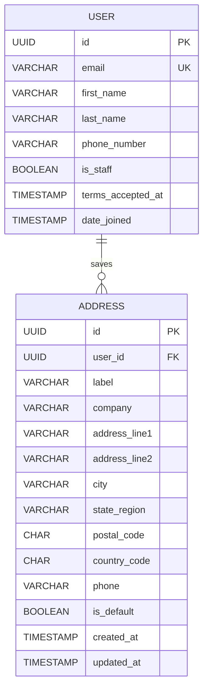

# Account Database Architecture

Minimal view of the Account data needed for the Profile and Saved Addresses screens in the [Account Figma file](./figma/figma.md). It reuses the shared [`User` and `Address` models](../../database/database-architecture.md) and does not define duplicate account tables. Order History and Order Details continue to use the Order module's existing models.

## Models

### `User`

The authenticated customer identity and profile. Authentication owns this model and its credential lifecycle.

| Field | Type | Purpose and rules |
|---|---|---|
| `id` | UUID, primary key | Customer identifier. |
| `email` | Email | Required and unique case-insensitively; normalize before save. |
| `first_name`, `last_name` | String | Required customer name fields. |
| `phone_number` | String | Required contact number; validate and normalize per the shared policy. |
| `password` | Django auth password field | Store only Django's encoded password hash; never expose in the API. |
| `terms_accepted_at` | nullable timestamp | Server-set acceptance evidence; customer cannot edit it. |
| `is_staff` | Boolean, default false | Server-managed authorization field; customer cannot edit it. |
| `date_joined` | timestamp | Account creation time. |

Profile updates are not defined by the current shared API contract. Do not add account fields or mutation semantics based only on the visual Edit profile button.

### `Address`

Reusable, customer-owned address information shown on the Saved Addresses screen.

| Field | Type | Purpose and rules |
|---|---|---|
| `id` | UUID, primary key | Address identifier. |
| `user_id` | UUID, foreign key → `User.id` | Required owner; deleting a user cascades to reusable addresses subject to retention policy. |
| `label` | String, optional | Display label such as Home or Work. |
| `company` | String, optional | Optional organization details. |
| `address_line1` | String | Required street/address. |
| `address_line2` | String, optional | Apartment/unit details. |
| `city` | String | Required city. |
| `state_region` | String | Required Indian state or union territory. |
| `postal_code` | String(6) | Indian PIN; validate `^[1-9][0-9]{5}$`. |
| `country_code` | String(2), default `IN` | ISO code; current schema permits only `IN`. |
| `phone` | String | Required address contact number. |
| `is_default` | Boolean, default false | At most one default address per customer. |
| `created_at`, `updated_at` | timestamps | Address creation and last update. |

## Relationships and constraints

- `User 1 — many Address`.
- Enforce an index on `(user_id, is_default)` and a conditional unique constraint on `user_id` where `is_default = true`, when supported by the database.
- Validate address ownership on every read, update, and delete.
- Set a new default by clearing the existing default and setting the new one in a transaction.
- Enforce `country_code = 'IN'`; validate PIN format in application validation and with a database check where supported.
- Never use the mutable `Address` row as the only order-delivery record. The Order module stores the immutable shipment address snapshot.

## ER diagram

