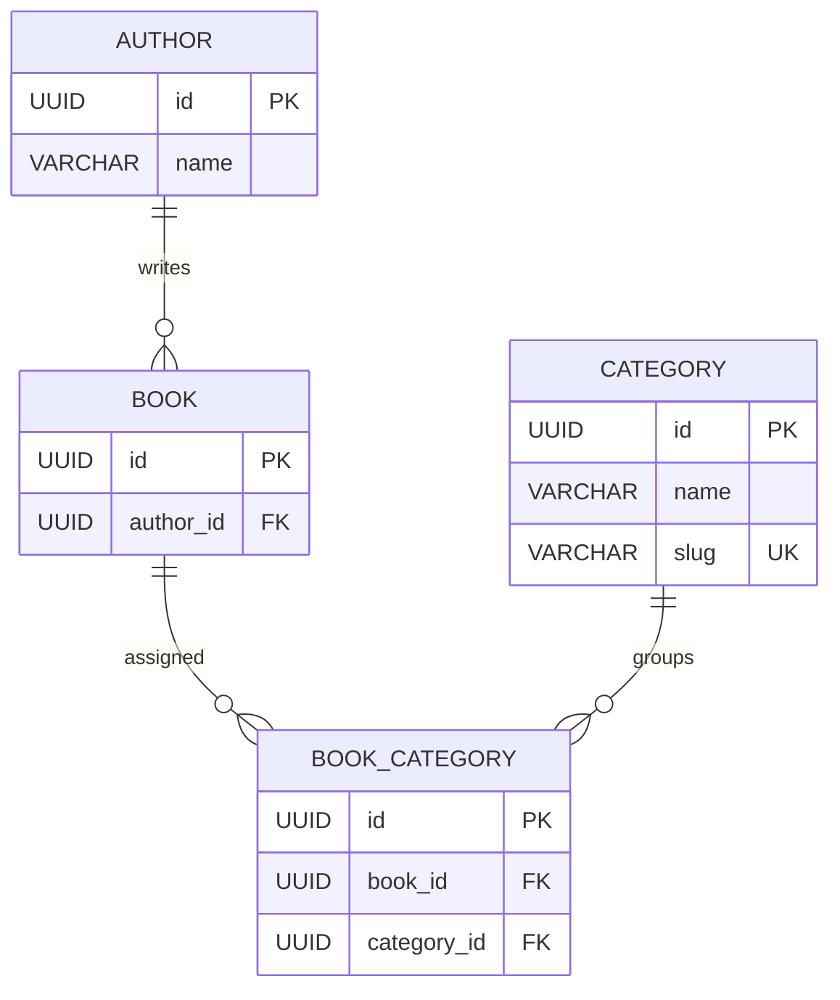

# Admin Database Architecture

The Admin module manages the existing catalog entities; it does not introduce parallel admin-only copies. These relationships follow the shared [database architecture](../../database/database-architecture.md).

## Catalog entities

### `Author`

| Field | Type | Notes |
|---|---|---|
| `id` | UUID, primary key | Stable author identifier used by the admin dropdown. |
| `name` | String(200) | Required display name. |

One author may be associated with multiple books. Do not hard-delete an author while a book references it; the shared schema uses `PROTECT` for the required Book foreign key.

### `Category`

| Field | Type | Notes |
|---|---|---|
| `id` | UUID, primary key | Stable category identifier used by the admin multi-select. |
| `name` | String(100) | Required display name. |
| `slug` | Slug(120), unique | Stable catalog/filter identifier. |

### `Book`

Relevant relationship fields in the shared Book schema:

| Field | Type | Notes |
|---|---|---|
| `id` | UUID, primary key | Stable book identifier. |
| `author_id` | Required FK → `Author.id` | Exactly one author per book; protect referenced author rows. |

Category assignment is many-to-many, not a direct Category foreign key:

### `BookCategory`

| Field | Type | Notes |
|---|---|---|
| `id` | UUID, primary key | Join-row identifier in the shared schema. |
| `book_id` | FK → `Book.id` | Delete join rows when a book is deleted according to shared retention rules. |
| `category_id` | FK → `Category.id` | Protect category rows while linked. |

Enforce uniqueness on `(book_id, category_id)`. A book can have zero or more categories. The Admin Book form's Author dropdown writes `author_id`; its Categories multi-select reads/writes the associated `BookCategory` rows.

## Relationships

## Admin integrity rules

- Validate `authorId` and every supplied `categoryIds` value against existing records.
- If a PATCH omits `categoryIds`, preserve current category relationships. An explicitly empty list clears them.
- Protect historical orders: updates to author/category metadata do not rewrite order-item title, author, or category snapshots where those have been captured.
- Require staff permission for every management action and audit catalog mutations.