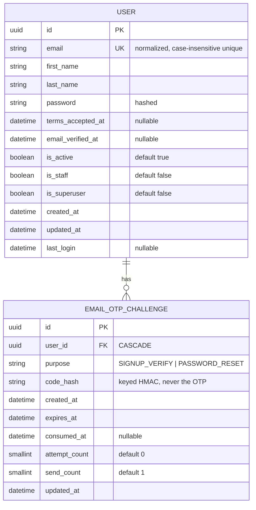

# Authentication Database Architecture

## ER diagram

One user has zero or many OTP challenges; each challenge belongs to exactly one user. The authentication session/token has no entity yet (see below).

## Entities

### User

Identity, credentials, account-verification state, and server-managed status flags (`is_active`, `is_staff`, `is_superuser`). 

| Field | Type | Key / requirement | Notes |
| --- | --- | --- | --- |
| `id` | `UUIDField` | PK, required | UUID4 recommended. |
| `email` | `EmailField` | required, unique case-insensitively | Normalize before save and login. |
| `first_name` | `CharField(150)` | required |  |
| `last_name` | `CharField(150)` | required |  |
| `password` | Django auth password field | required | Store only the encoded hash using `set_password()`/`create_user()`. |
| `terms_accepted_at` | `DateTimeField` | nullable for provisioned/legacy accounts | Set server-side for signup after explicit acceptance. |
| `email_verified_at` | `DateTimeField` | nullable | Null means signup email is not verified. Set after valid signup OTP. |
| `is_active` | `BooleanField` | default `True` | Server-managed; inactive accounts cannot log in. Never customer-editable. |
| `is_staff` | `BooleanField` | default `False` | Server-managed; never customer-editable. |
| `is_superuser` | `BooleanField` | default `False` | Server-managed; grants all permissions. Never customer-editable or settable through signup. |
| `created_at` | `DateTimeField` | server-set, required | UTC-aware; records account creation time (use instead of a duplicate `date_joined` field). |
| `updated_at` | `DateTimeField` | server-maintained, required | UTC-aware; update when account fields or verification state change. |
| `last_login` | `DateTimeField` | nullable, Django-managed | UTC-aware; most recent successful login, not a substitute for `updated_at`. |

Do not add `password_confirmation`, plaintext password, or OTP value fields. `is_active`, `is_staff`, and `is_superuser` are server-managed and must not be accepted from signup or profile requests or returned to customers. Django groups/permissions manage specific staff authorization.

### EmailOTPChallenge

Short-lived challenge for signup email verification or password reset.

| Field | Type | Key / requirement | Notes |
| --- | --- | --- | --- |
| `id` | `UUIDField` | PK, required |  |
| `user` | `ForeignKey(User)` | FK, required | `CASCADE`; challenge belongs to one account. |
| `purpose` | `CharField(24)` | required | `SIGNUP_VERIFY` or `PASSWORD_RESET`. |
| `code_hash` | `CharField(64)` | required | Store a keyed SHA-256 HMAC hex digest using a server-held pepper, never the OTP itself; compare safely. |
| `created_at` | `DateTimeField` | required | UTC-aware issue time. |
| `expires_at` | `DateTimeField` | required | Expiry is policy-controlled; exact duration is open. |
| `consumed_at` | `DateTimeField` | nullable | Set on successful, one-time use. |
| `attempt_count` | `PositiveSmallIntegerField` | default `0` | Increment on failed verification; maximum is an open policy. |
| `send_count` | `PositiveSmallIntegerField` | default `1` | Tracks resend volume; maximum and cooldown are open policy. |
| `updated_at` | `DateTimeField` | server-maintained, required | UTC-aware; update on resend, verification attempt, or consumption. `created_at` already records the row creation/initial issue time. |

#### Signup request-only fields

These values are accepted by the signup request but are not database columns:

| Field | Type | Handling |
| --- | --- | --- |
| `password_confirmation` | `CharField` / string input | Compare with `password` during validation; discard immediately. Never persist, hash separately, return, or log it. |
| `terms_accepted` | `BooleanField` / boolean input | Must be `True`; record acceptance using the server-set `terms_accepted_at` on `User`. |

### Authentication session/token

No application-owned session/token entity is selected yet. Use Django's session storage or a compatible token implementation after deciding cookie/bearer transport, expiry, refresh, persistence, and revocation. Never store raw bearer tokens if the selected implementation supports storing a digest.

## Keys and relationships

- `User.id` is the primary key; normalized `User.email` is unique.
- `User.created_at` and `User.updated_at` record account creation and later account/verification changes; `last_login` is separate login metadata.
- `EmailOTPChallenge.id` is the primary key.
- `EmailOTPChallenge.user_id` is a required foreign key to `User.id`.
- `EmailOTPChallenge.created_at` and `EmailOTPChallenge.updated_at` record challenge issue time and subsequent resend/verification lifecycle changes.
- One user can have zero or many historical OTP challenges; each challenge belongs to exactly one user.
- Enforce at most one usable challenge per user and purpose through application transactions and invalidate older challenges when issuing a replacement. Add a database constraint only if compatible with chosen state/SQLite version.

