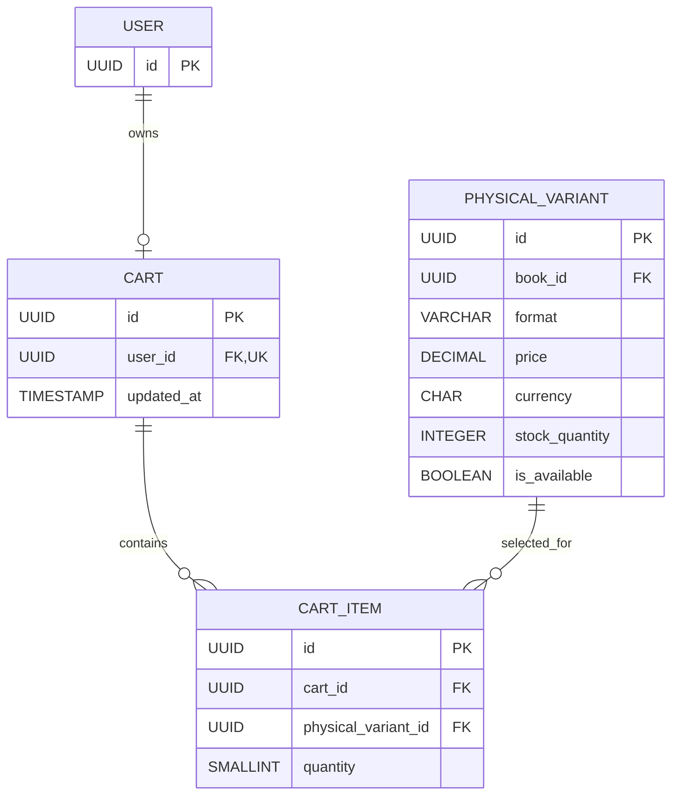

# Cart Database Architecture

Minimal relational model for the Shopping Cart screen in the [BookBloom Figma file](https://www.figma.com/design/CMaYhdVPa2mBS0diJ57KGm/BookBloom?node-id=437-3). The broader schema is documented in [database-architecture.md](../../database/database-architecture.md).

## Models

### `Cart`

One active cart per registered customer.

| Field | Type | Notes |
|---|---|---|
| `id` | UUID, primary key | Public cart identifier |
| `user_id` | UUID, one-to-one foreign key → `User.id` | Required; deleting the user cascades to the cart |
| `updated_at` | timestamp | Updated when cart contents change |

### `CartItem`

One row per physical variant in a cart.

| Field | Type | Notes |
|---|---|---|
| `id` | UUID, primary key | Cart-line identifier |
| `cart_id` | UUID, foreign key → `Cart.id` | Required; deleting the cart cascades to its lines |
| `physical_variant_id` | UUID, foreign key → `PhysicalVariant.id` | Required; identifies the selected format and current catalog price |
| `quantity` | positive small integer | Required; minimum value is 1 |

## Relationships and constraints

- `User 1 — 0..1 Cart`
- `Cart 1 — many CartItem`
- `PhysicalVariant 1 — many CartItem`
- Enforce unique (`cart_id`, `physical_variant_id`) so a variant appears only once per cart.
- Enforce `quantity >= 1` with application validation and a database check constraint.
- Restrict deletion of a referenced physical variant while cart lines refer to it; archive or disable the variant instead.

## ER Diagram

## Pricing and order summary

- Do not persist cart prices, discounts, subtotal, shipping, or total as authoritative values. These are derived from the current catalog physical variant and cart quantities.
- The cart API returns current prices as INR decimal strings and calculates the summary. Checkout revalidates price and stock, then snapshots purchase prices into immutable order items.
- The design shows an optional struck-through original price. If promotional/list pricing is implemented, source it from catalog pricing data; do not treat it as a cart-item price snapshot.
- Shipping is currently free. Checkout remains authoritative for the final payable total.

## Scope assumptions

The design and project schema assume registered-customer carts only. Anonymous carts, cart merging, expiry, reservation of stock, and price-lock behavior are not defined here.
