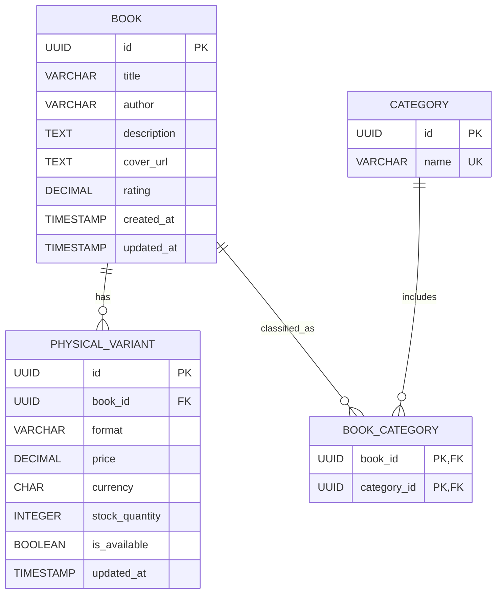

# Catalog Database Architecture

This small relational model supports the Home, Catalog Search + Filters, and Book Detail screens in the [BookBloom Figma file](https://www.figma.com/design/CMaYhdVPa2mBS0diJ57KGm/BookBloom?node-id=410-3).

## Tables

### `books`

One row per distinct title.

| Column | Type | Notes |
|---|---|---|
| `id` | UUID / primary key | Stable catalog identifier |
| `title` | VARCHAR | Display title; searchable |
| `author` | VARCHAR | Display author; searchable |
| `description` | TEXT | Detail-screen description |
| `cover_url` | TEXT | Cover image location |
| `rating` | DECIMAL(2,1), nullable | Display rating from 1 to 5 |
| `created_at` | TIMESTAMP | Supports newest-first sorting |
| `updated_at` | TIMESTAMP | Record update time |

### `categories`

| Column | Type | Notes |
|---|---|---|
| `id` | UUID / primary key | Category identifier |
| `name` | VARCHAR / unique | Examples in Figma: Kids, Fiction, Romance, Literature, Mystery & Thrillers |

### `book_categories`

Join table for the many-to-many relationship between books and categories.

| Column | Type | Notes |
|---|---|---|
| `book_id` | UUID / foreign key → `books.id` | Part of composite primary key |
| `category_id` | UUID / foreign key → `categories.id` | Part of composite primary key |

### `PhysicalVariant`

One row per purchasable physical format of a book, matching the existing catalog model. Keeping prices on the variant supports the different Hardcover and Paperback prices shown on the detail screen.

| Column | Type | Notes |
|---|---|---|
| `id` | UUID / primary key | Physical variant identifier; used by cart requests as `physicalVariantId` |
| `book_id` | UUID / foreign key → `books.id` | Parent book |
| `format` | VARCHAR | `HARDCOVER` or `PAPERBACK` |
| `price` | DECIMAL(12,2) | Current price |
| `currency` | CHAR(3) | `INR` |
| `stock_quantity` | Positive integer | Available physical stock |
| `is_available` | BOOLEAN | Whether the variant is enabled for sale |
| `updated_at` | TIMESTAMP | Last catalog update |

Enforce a unique constraint on (`book_id`, `format`) so a book has at most one variant per format.

## Relationships

- A book can have multiple categories and physical variants.
- A category can be assigned to multiple books.
- Ratings belong to the book in this minimal model; the design does not show individual reviews.

## ER Diagram

## Query support

- Search `books.title` and `books.author`; include other searchable metadata only when defined by the application.
- Filter through `book_categories` and `PhysicalVariant.format`.
- Apply price bands to `PhysicalVariant.price` and the minimum-rating filter to `books.rating`.
- Sort by `books.title`, `PhysicalVariant.price`, or `books.created_at` as requested.
- Apply pagination after filtering and sorting, using a page size of 12 by default (`LIMIT 12 OFFSET (page - 1) * 12`). Compute the result total from the filtered set before applying the limit and offset.
- Use a deterministic tie-breaker (such as `books.id`) with each sort order so moving between pages does not produce duplicate or skipped books when sort values match.
- Add indexes for title, author, category joins, variant format, and variant price as needed for query performance.

## Assumptions and exclusions

- The Figma screens show book ratings but no individual reviews, ISBN, or variant-specific cover. Stock is included to align with the existing `PhysicalVariant` catalog model.
- “Newest” uses `created_at`; confirm whether the product should instead sort by a publication date.
- The design does not define the business rule for the default/popularity ordering.
- The current page and page size are request/UI state and are not persisted in the catalog database.
