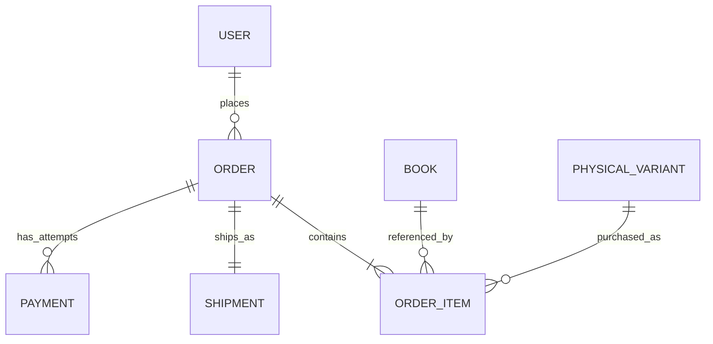

# Order Database Architecture

Minimal view of the order data needed for Order History and Order Details, based on the [Figma screen](https://www.figma.com/design/CMaYhdVPa2mBS0diJ57KGm/BookBloom?node-id=449-55). These models align with the shared [database architecture](../../database/database-architecture.md); this document does not introduce duplicate order tables.

## Models used

### `Order`

One immutable commercial record for a customer's placed order.

| Field | Purpose |
|---|---|
| `id` (UUID, PK) | API identifier |
| `order_number` (unique) | Human-readable reference shown in history and details |
| `user_id` (FK → `User.id`) | Customer who owns the order |
| `status` | Payment/confirmation lifecycle, such as `PENDING_PAYMENT` or `CONFIRMED` |
| `currency` | `INR` |
| `subtotal`, `shipping_amount`, `tax_amount`, `discount_amount`, `total` | Immutable monetary snapshot using decimal storage |
| `placed_at`, `confirmed_at`, `created_at` | Order dates used by the history and detail views |

### `OrderItem`

Immutable purchase-time item details used for order line display.

| Field | Purpose |
|---|---|
| `id` (UUID, PK) | Order line identifier |
| `order_id` (FK → `Order.id`) | Parent order |
| `book_id`, `physical_variant_id` (FKs) | References to catalog records |
| `title_snapshot`, `format_snapshot` | Preserve the purchased title and format if catalog data changes |
| `quantity` | Number of copies |
| `unit_price`, `line_total`, `currency` | Purchase-time price snapshot |

### `Shipment`

One delivery record per order, with an immutable address snapshot and fulfillment lifecycle independent of order/payment status.

| Field | Purpose |
|---|---|
| `id` (UUID, PK) | Shipment identifier |
| `order_id` (unique FK → `Order.id`) | One-to-one order relationship |
| `status` | Shipment lifecycle, such as `PENDING`, `PROCESSING`, `SHIPPED`, or `DELIVERED` |
| `recipient_name`, address fields, `phone` | Destination snapshot shown in order details |
| `carrier`, `tracking_reference` | Optional fulfillment details |
| `shipped_at`, `delivered_at`, `created_at`, `updated_at` | Shipment dates |

### `Payment`

Payment attempts belong to an order. Expose only safe summary fields required for the payment-method line: method type, optional card brand/last four, status, and amount. Never persist or return PAN, CVV, or payment credentials.

## Relationships

## Integrity rules

- Restrict customer reads to records whose `Order.user_id` matches the authenticated user.
- Preserve order item, total, and shipment-address snapshots; do not recompute them from current catalog or address records.
- Persist monetary values with decimal fields, never floating point.
- Keep `Order.status` independent from `Shipment.status`.
- A confirmed order requires authoritative payment success. Shipment progress is advanced separately by fulfillment operations.
- Enforce `quantity >= 1`, `shipping_amount = 0.00` under the current free-shipping policy, and the documented currency rules.

The complete field definitions, payment lifecycle, and fulfillment-policy gaps are maintained in the shared database architecture document.
